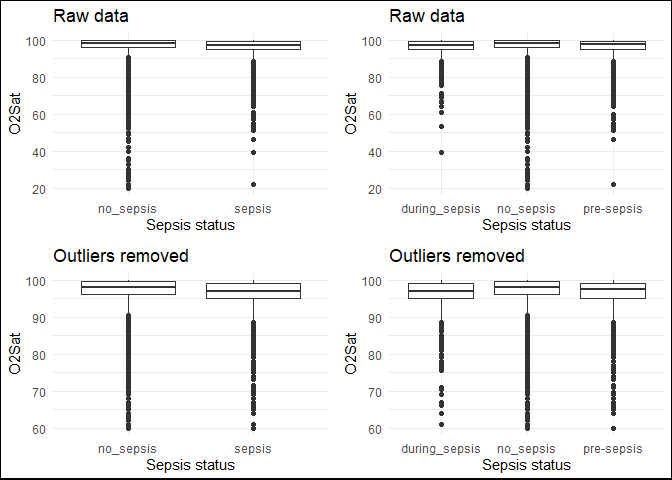
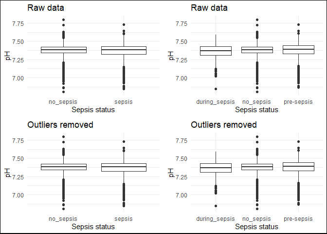

data_exploration
================
Lauren
2023-11-20

## BMEG 423/523 CDSS Assignment

### Initial Data Exploration

Team 2  
2023-11-20

The training and test data used in this project are from the 2019
PhysioNet Computing in Cardiology Challenge. More information about the
challenge can be found
[here](https://physionet.org/content/challenge-2019/1.0.0/).

This document includes the following:  
1. R code to merge all training cases into a single dataframe (which can
be easily exported to a csv)  
2. Plots illustrating the characteristics of the dataset  
b. Comparing patients who never had sepsis to those who didn’t have
sepsis initially, but developed it, and those who had sepsis from the
beginning of the dataset  
c. Characteristics of patient data 4-6 hours prior to sepsis diagnosis

``` r
#LOAD REQUIRED PACKAGES
library(tidyverse)
library(gridExtra)
library(kableExtra)
```

    ## Warning: package 'kableExtra' was built under R version 4.3.2

``` r
library(grid)
library(car)
```

    ## Warning: package 'car' was built under R version 4.3.2

    ## Warning: package 'carData' was built under R version 4.3.2

#### Merge the raw training and test data and save as an RData file

``` r
#FUNCTION TO MERGE ALL TRAINING CASES INTO ONE DATAFRAME AND SAVE AS RData FILE AND MERGE ALL TEST CASES INTO ANOTHER DATAFRAME # This code is based on code provided in the assignment package
load_cinc_data <- function(fromfile = T){
  #IF THE MERGED DATA FILE ALREADY EXISTS, JUST LOAD IT IN
  if (fromfile == T){
    load("CinC.RData")
  } 
  
  else {
    #CREATE A FILE CALLED CINC.Rdata TO HOLD THE MERGED TRAINING DATA FROM ALL PATIENTS WITH A COLUMN ADDED FOR PATIENT ID
    files <- list.files(here::here("training_2023-11-05"), full.names = TRUE) #creates character vector of the names of files in the training data folder
    cinc_dat <- NULL #initialize data frame to hold all patient data
    for (f in files){
      fname <- substr(basename(f), 1, nchar(basename(f))-4) #basically just removes ".csv" from the file names
      #print(fname)
      pdat <- read.delim(f, sep = ",", na = "NA") #create temp variable called pdat that contains a data frame read in from the patient data csv file
      pdat <- cbind(patient = fname, pdat) #adds a column to the data frame with the patient ID
      cinc_dat <- rbind(cinc_dat, pdat) #add data for current patient to data frame with all patient data (bind by row)
    }
    # Save the data
    save(cinc_dat, file = "CinC.RData")
    
    #CREATE A FILE CALLED CINC_Test.Rdata TO HOLD THE MERGED TEST DATA FROM ALL PATIENTS WITH A COLUMN ADDED FOR PATIENT ID
    files <- list.files(here::here("testing_2023-11-05"), full.names = TRUE)
    cinc_dat_test <- NULL
    for (f in files){
      fname <- substr(basename(f), 1, nchar(basename(f))-4)
      #print(fname)
      pdat <- read.delim(f, sep = ",", na = "NA")
      pdat <- cbind(patient = fname, pdat)
      cinc_dat_test <- rbind(cinc_dat_test, pdat)
    }
    # Save the data
    save(cinc_dat_test, file = "CinC_Test.RData")
  }
  return(cinc_dat)
}
```

#### Load the merged data to a data frame in the working environment

``` r
#cinc_data <- load_cinc_data(fromfile = F) #run this to merge data and save RData files if they don't exist yet
cinc_data <- load_cinc_data() #run this to load merged training data into a data frame called cinc_data if the RData files already exist
```

#### Organize the data

``` r
#Get vector with all patient IDs
patientIDs <- cinc_data %>%
  select(patient) %>%
  distinct(patient)

#Get patient IDs for all patients with a positive sepsis label at some point
sepsis_patientIDs <- cinc_data %>%
  filter(SepsisLabel == 1) %>%
  distinct(patient)

#Get patient IDs for all patients who never developed sepsis
no_sepsis_patientIDs <- anti_join(patientIDs, sepsis_patientIDs, by = "patient")

#Data frame with all data for patients with a positive sepsis label at some point
sepsis <- cinc_data %>%
  filter(patient %in% sepsis_patientIDs[[1]])

#Data frame with all data for patients who never developed sepsis
no_sepsis <- cinc_data %>%
  filter(patient %in% no_sepsis_patientIDs[[1]])
```

#### Start analyzing data

In the summary table called “means”, I have computed the mean value of
each vital sign/lab value in the dataset for the following patient
groups: - All data for sepsis patients, including data before **and**
after positive sepsis diagnosis  
- Data for sepsis patients after their positive sepsis diagnosis (only
including rows of data where SepsisLabel = 1)  
- Data for sepsis patients before their positive sepsis diagnosis (only
including rows of data where SepsisLabel = 0)  
- All data for patients who never developed sepsis (patients for which
SepsisLabel = 0 throuhgout their ICU stay)

These mean values were calculated without cleaning or modifying any
values in the dataset. NA values were removed from the computations.

**Note:** I have not yet dealt with missing values (filling in or
interpolating) - this could affect the means.

| Demographic                                                                 | mean_HR | mean_O2sat | mean_Temp | mean_SBP | mean_MAP | mean_DBP | mean_Resp | mean_FiO2 | mean_pH | mean_BUN | mean_Creatinine | mean_Glucose | mean_Magnesium | mean_Potassium | mean_Hct | mean_Hgb | mean_WBC | mean_Age |
|:----------------------------------------------------------------------------|:--------|:-----------|:----------|:---------|:---------|:---------|:----------|:----------|:--------|:---------|:----------------|:-------------|:---------------|:---------------|:---------|:---------|:---------|:---------|
| All data for sepsis-positive patients before and after positive SepsisLabel | 89.941  | 96.844     | 36.981    | 119.78   | 79.921   | 62.114   | 20.165    | 0.53338   | 7.3718  | 33.229   | 1.9702          | 135.38       | 2.1050         | 4.2015         | 29.839   | 9.9916   | 13.378   | 62.254   |
| Data for sepsis-positive patients after positive SepsisLabel                | 92.114  | 96.590     | 37.164    | 118.67   | 78.987   | 61.808   | 20.816    | 0.56260   | 7.3596  | 34.100   | 2.2350          | 136.38       | 2.0710         | 4.2554         | 29.984   | 9.9888   | 14.461   | 62.098   |
| Data for sepsis-positive patients before positive SepsisLabel               | 89.573  | 96.888     | 36.953    | 119.97   | 80.079   | 62.161   | 20.058    | 0.52801   | 7.3744  | 33.054   | 1.9148          | 135.20       | 2.1112         | 4.1908         | 29.809   | 9.9922   | 13.151   | 62.280   |
| All data for sepsis-negative patients                                       | 85.356  | 97.147     | 36.993    | 122.30   | 81.683   | 63.065   | 18.827    | 0.53577   | 7.3761  | 23.652   | 1.5729          | 137.00       | 2.0628         | 4.1980         | 30.217   | 10.1528  | 11.523   | 62.692   |

#### Plotting data as boxplots

``` r
#Create copy of cinc_data with some added labels to help group the data based on sepsis state
cinc_data_1 <- cinc_data %>%
  mutate(LabelA = case_when(
    patient %in% no_sepsis_patientIDs[[1]] ~ "no_sepsis",
    patient %in% sepsis_patientIDs[[1]] ~ "sepsis"
  )) %>%
  mutate(LabelB = case_when(
    patient %in% no_sepsis_patientIDs[[1]] ~ "no_sepsis",
    SepsisLabel == 0 ~ "pre-sepsis",
    TRUE ~ "during_sepsis"
  ))

#Create table with min and max cutoffs
#Based on values reported by Firoozabadi & Babaeizadeh, 2019 (cinc.org/archives/2019/pdf/CinC2019-023.pdf)
minmax <- tribble(
  ~variable, ~min, ~max,
  "HR", 10, 300,
  "O2Sat", 60, 100,
  "Temp", 32, 42.2,
  "SBP", 40, 280,
  "MAP", 0, 300,
  "DBP", 20, 130,
  "Resp", 5, 60,
  "FiO2", 0, 1,
  "pH", 6, 8,
  "BUN", 0, 500,
  "Creatinine", 0, 10,
  "Glucose", 0, 1000,
  "Magnesium", 0, 10,
  "Potassium", 1, 10,
  "Hct", 10, 70,
  "Hgb", 2, 22,
  "WBC", 0, 50,
  "Age", 0, 150
)

#Replace outliers with NA using the min and max valuesin minmax
cinc_data_2 <- cinc_data_1
for (i in 1:18) {
  cinc_data_2[minmax[[1]][i]][cinc_data_2[minmax[[1]][i]] < minmax[[2]][i] | 
                                cinc_data_2[minmax[[1]][i]] >   minmax[[3]][i]] <- NA
}
```

``` r
#Loop for plotting boxplots for all of the variables
for (i in 3:20){
  p1 <- cinc_data_1 %>% ggplot(aes(x = LabelA, y = cinc_data_1[,i])) +
  geom_boxplot(na.rm = TRUE) +
  xlab("Sepsis status") +
  ylab(names(cinc_data_1[i])) +
  ggtitle("Raw data") +
  theme_minimal()
p2 <- cinc_data_1 %>% ggplot(aes(x = LabelB, y = cinc_data_1[,i])) +
  geom_boxplot(na.rm = TRUE) +
  xlab("Sepsis status") +
  ylab(names(cinc_data_1[i])) +
  ggtitle("Raw data") +
  theme_minimal()

#outliers removed
p3 <- cinc_data_2 %>% ggplot(aes(x = LabelA, y = cinc_data_2[,i])) +
  geom_boxplot(na.rm = TRUE) +
  xlab("Sepsis status") +
  ylab(names(cinc_data_2[i])) +
  ggtitle("Outliers removed") +
  theme_minimal()
p4 <- cinc_data_2 %>% ggplot(aes(x = LabelB, y = cinc_data_2[,i])) +
  geom_boxplot(na.rm = TRUE) +
  xlab("Sepsis status") +
  ylab(names(cinc_data_2[i])) +
  ggtitle("Outliers removed") +
  theme_minimal()

grid.arrange(p1, p2, p3, p4, nrow = 2)
grid.rect(width = 1, height = 1, gp = gpar(lwd = 2, col = "black", fill = NA))
}
```

<!-- --><!-- --><!-- --><!-- --><!-- --><!-- --><!-- --><!-- --><!-- --><!-- --><!-- --><!-- --><!-- --><!-- --><!-- --><!-- --><!-- --><!-- -->

### Significance Testing

**Using raw data before removing outliers**  
Results are saved in the statistics variable

``` r
#SIGNIFICANCE TESTING FOR RAW DATA BEFORE REMOVING OUTLIERS
variables <- names(cinc_data[3:20])

levene_pval_2groups <- NULL
ttest_pval_2groups <- NULL
levene_pval_3groups <- NULL
anova_pval_3groups <- NULL

#FOR DATA BEFORE OUTLIER REMOVAL
for (i in 3:20) {
  #Levene's test for data stratified based on no sepsis and sepsis
  #A p-value less than significance suggests that variances are not equal
  levene_temp_2groups <- leveneTest(cinc_data_1[, i] ~ LabelA, data = cinc_data_1)
  
  #Perform t-test for data stratified based on no sepsis and sepsis 
  if (levene_temp_2groups$`Pr(>F)`[1] < 0.05) { #Variances are not equal
    ttest_temp_2groups <- t.test(cinc_data_1[, i] ~ LabelA, data = cinc_data_1, var.equal = FALSE, na.action = na.omit)
  }
  else { #Variances are equal
    ttest_temp_2groups <- t.test(cinc_data_1[, i] ~ LabelA, data = cinc_data_1, var.equal = TRUE, na.action = na.omit)
  }
  
  #Levene's test for data stratified based on no sepsis, pre-sepsis, and during sepsis
  #A p-value less than significance suggests that variances are not equal
  levene_temp_3groups <- leveneTest(cinc_data_1[, i] ~ LabelB, data = cinc_data_1)
  
  #Perform 1-way ANOVA for data stratified based on no sepsis, pre-sepsis, and during sepsis
  if (levene_temp_3groups$`Pr(>F)`[1] < 0.05) { #Variances are not equal
    anova_temp_3groups <- oneway.test(cinc_data_1[, i] ~ LabelB, data = cinc_data_1, var.equal = FALSE, na.action = na.omit)
  }
  else { #Variances are equal
    anova_temp_3groups <- oneway.test(cinc_data_1[, i] ~ LabelB, data = cinc_data_1, var.equal = TRUE, na.action = na.omit)
  }
  
  #Extract the p-values from each test
  levene_pval_2groups <- rbind(levene_pval_2groups, levene_temp_2groups$`Pr(>F)`[1])
  ttest_pval_2groups <- rbind(ttest_pval_2groups, ttest_temp_2groups$p.value)
  levene_pval_3groups <- rbind(levene_pval_3groups, levene_temp_3groups$`Pr(>F)`[1])
  anova_pval_3groups <- rbind(anova_pval_3groups, anova_temp_3groups$p.value)
}

#Put data in correct format
statistics <- cbind(variables, levene_pval_2groups, ttest_pval_2groups, levene_pval_3groups,anova_pval_3groups)

statistics <- as.data.frame(statistics)
colnames(statistics) <- (c("variables", "levene_pval_2groups", "ttest_pval_2groups",
                           "levene_pval_3groups", "anova_pval_3groups"))
statistics$levene_pval_2groups <- as.double(statistics$levene_pval_2groups)
statistics$ttest_pval_2groups <- as.double(statistics$ttest_pval_2groups)
statistics$levene_pval_3groups <- as.double(statistics$levene_pval_3groups)
statistics$anova_pval_3groups <- as.double(statistics$anova_pval_3groups)

knitr::kable(format(statistics, digits = 3), format = "markdown")
```

| variables  | levene_pval_2groups | ttest_pval_2groups | levene_pval_3groups | anova_pval_3groups |
|:-----------|:--------------------|:-------------------|:--------------------|:-------------------|
| HR         | 2.76e-111           | 0.00e+00           | 3.42e-106           | 0.00e+00           |
| O2Sat      | 6.34e-56            | 3.66e-53           | 1.71e-63            | 6.41e-55           |
| Temp       | 4.16e-130           | 1.48e-01           | 2.17e-143           | 3.32e-16           |
| SBP        | 2.44e-26            | 1.27e-63           | 3.82e-26            | 2.20e-63           |
| MAP        | 7.74e-05            | 1.37e-72           | 3.97e-07            | 2.59e-73           |
| DBP        | 1.34e-06            | 2.23e-25           | 1.47e-07            | 2.25e-24           |
| Resp       | 1.84e-288           | 3.57e-284          | 6.44e-293           | 8.15e-278          |
| FiO2       | 3.18e-01            | 4.76e-01           | 1.68e-03            | 6.54e-05           |
| pH         | 1.22e-56            | 6.12e-03           | 6.68e-56            | 3.19e-05           |
| BUN        | 1.29e-57            | 1.35e-81           | 1.19e-56            | 4.35e-73           |
| Creatinine | 1.98e-13            | 3.43e-19           | 1.17e-13            | 4.78e-18           |
| Glucose    | 8.76e-01            | 1.39e-02           | 1.66e-02            | 3.16e-02           |
| Magnesium  | 3.31e-01            | 2.40e-07           | 9.82e-02            | 2.01e-07           |
| Potassium  | 1.02e-09            | 7.59e-01           | 5.39e-11            | 1.02e-01           |
| Hct        | 3.90e-03            | 1.78e-04           | 1.55e-06            | 5.50e-04           |
| Hgb        | 2.12e-06            | 2.03e-05           | 4.82e-09            | 1.13e-04           |
| WBC        | 2.98e-11            | 9.00e-13           | 1.99e-12            | 1.10e-11           |
| Age        | 1.02e-14            | 4.24e-06           | 1.03e-13            | 1.94e-05           |

**Using raw data after removing outliers**  
Results are saved in the statistics_outliers_removed variable

``` r
#SIGNIFICANCE TESTING OF DATA AFTER REMOVING OUTLIERS
variables <- names(cinc_data[3:20])

levene_pval_2groups <- NULL
ttest_pval_2groups <- NULL
levene_pval_3groups <- NULL
anova_pval_3groups <- NULL

#FOR DATA BEFORE OUTLIER REMOVAL
for (i in 3:20) {
  #Levene's test for data stratified based on no sepsis and sepsis
  #A p-value less than significance suggests that variances are not equal
  levene_temp_2groups <- leveneTest(cinc_data_2[, i] ~ LabelA, data = cinc_data_2)
  
  #Perform t-test for data stratified based on no sepsis and sepsis 
  if (levene_temp_2groups$`Pr(>F)`[1] < 0.05) { #Variances are not equal
    ttest_temp_2groups <- t.test(cinc_data_2[, i] ~ LabelA, data = cinc_data_2, var.equal = FALSE, na.action = na.omit)
  }
  else { #Variances are equal
    ttest_temp_2groups <- t.test(cinc_data_2[, i] ~ LabelA, data = cinc_data_2, var.equal = TRUE, na.action = na.omit)
  }
  
  #Levene's test for data stratified based on no sepsis, pre-sepsis, and during sepsis
  #A p-value less than significance suggests that variances are not equal
  levene_temp_3groups <- leveneTest(cinc_data_2[, i] ~ LabelB, data = cinc_data_2)
  
  #Perform 1-way ANOVA for data stratified based on no sepsis, pre-sepsis, and during sepsis
  if (levene_temp_3groups$`Pr(>F)`[1] < 0.05) { #Variances are not equal
    anova_temp_3groups <- oneway.test(cinc_data_2[, i] ~ LabelB, data = cinc_data_2, var.equal = FALSE, na.action = na.omit)
  }
  else { #Variances are equal
    anova_temp_3groups <- oneway.test(cinc_data_2[, i] ~ LabelB, data = cinc_data_2, var.equal = TRUE, na.action = na.omit)
  }
  
  #Extract the p-values from each test
  levene_pval_2groups <- rbind(levene_pval_2groups, levene_temp_2groups$`Pr(>F)`[1])
  ttest_pval_2groups <- rbind(ttest_pval_2groups, ttest_temp_2groups$p.value)
  levene_pval_3groups <- rbind(levene_pval_3groups, levene_temp_3groups$`Pr(>F)`[1])
  anova_pval_3groups <- rbind(anova_pval_3groups, anova_temp_3groups$p.value)
}

#Put data in correct format
statistics_outliers_removed <- cbind(variables, levene_pval_2groups, ttest_pval_2groups, levene_pval_3groups,
                                     anova_pval_3groups)

statistics_outliers_removed <- as.data.frame(statistics_outliers_removed)
colnames(statistics_outliers_removed) <- (c("variables", "levene_pval_2groups", "ttest_pval_2groups",
                                            "levene_pval_3groups", "anova_pval_3groups"))
statistics_outliers_removed$levene_pval_2groups <- as.double(statistics_outliers_removed$levene_pval_2groups)
statistics_outliers_removed$ttest_pval_2groups <- as.double(statistics_outliers_removed$ttest_pval_2groups)
statistics_outliers_removed$levene_pval_3groups <- as.double(statistics_outliers_removed$levene_pval_3groups)
statistics_outliers_removed$anova_pval_3groups <- as.double(statistics_outliers_removed$anova_pval_3groups)

knitr::kable(format(statistics_outliers_removed, digits = 3), format = "markdown")
```

| variables  | levene_pval_2groups | ttest_pval_2groups | levene_pval_3groups | anova_pval_3groups |
|:-----------|:--------------------|:-------------------|:--------------------|:-------------------|
| HR         | 2.76e-111           | 0.00e+00           | 3.42e-106           | 0.00e+00           |
| O2Sat      | 3.27e-69            | 1.67e-58           | 4.59e-78            | 2.65e-60           |
| Temp       | 2.58e-138           | 1.72e-01           | 2.94e-153           | 8.12e-16           |
| SBP        | 2.42e-26            | 3.47e-64           | 3.28e-26            | 6.39e-64           |
| MAP        | 7.74e-05            | 1.37e-72           | 3.97e-07            | 2.59e-73           |
| DBP        | 3.26e-07            | 1.06e-26           | 3.47e-08            | 1.09e-25           |
| Resp       | 3.48e-292           | 2.75e-302          | 1.95e-296           | 2.38e-295          |
| FiO2       | 3.42e-01            | 3.96e-01           | 4.85e-03            | 1.53e-04           |
| pH         | 1.22e-56            | 6.12e-03           | 6.68e-56            | 3.19e-05           |
| BUN        | 1.29e-57            | 1.35e-81           | 1.19e-56            | 4.35e-73           |
| Creatinine | 5.32e-25            | 4.54e-30           | 6.61e-24            | 4.61e-28           |
| Glucose    | 8.76e-01            | 1.39e-02           | 1.66e-02            | 3.16e-02           |
| Magnesium  | 3.31e-01            | 2.40e-07           | 9.82e-02            | 2.01e-07           |
| Potassium  | 5.95e-10            | 7.78e-01           | 1.86e-11            | 8.80e-02           |
| Hct        | 4.56e-03            | 1.47e-04           | 1.72e-06            | 4.59e-04           |
| Hgb        | 2.41e-06            | 2.30e-05           | 5.16e-09            | 1.27e-04           |
| WBC        | 1.54e-29            | 2.12e-23           | 1.12e-32            | 1.19e-21           |
| Age        | 1.02e-14            | 4.24e-06           | 1.03e-13            | 1.94e-05           |

### Effect size testing

Significance testing with p-values can give misleading results when the
dataset is extremely large. Namely, when the dataset is very large, even
a tiny effect might be interpreted as significant. Statistical
significance is effected by the sample size, and increasing sample size
always makes it more likely to get a statistically significant effect.
Effect sizes represent the practical significance - is the effect large
enough to matter in the real world? Effect size depends only on the data
and not on the size of the sample, making it a more appropriate metric
when dealing with very large datasets
[ref](https://www.scribbr.com/statistics/effect-size/#:~:text=Effect%20size%20tells%20you%20how,size%20indicates%20limited%20practical%20applications.).

Cohen’s d-test is the method I have chosen to analyze effect sizes in
this dataset. The *d* value is a measure of how many standard deviations
lie between the means of two groups. A *d* value with a magnitude of 0.2
is generally considered to represent a small effect, 0.5 is a medium
effect, and 0.8 or greater is a large effect. This test can only be used
to compare 2 different groups at a time. As such, I will structure this
analysis as follows:  
- I will calculate *d* for each variable to find the effect size between
the no sepsis and sepsis groups (i.e., all patients who never developed
sepsis vs. all patients who eventually developed sepsis)  
- I will then calculate *d* for each variable to find the effect size
between the no sepsis group and the  
- Pre-sepsis group (data for patients who developed sepsis while
SepsisLabel is still 0)  
- During sepsis group (data for patients who developed sepsis while
SepsisLabel is 1)

Note that the sign of d (negative vs. positive) just depends on which
group’s mean is greater.  
I will calculate these values for the raw data as well as the data after
outlier removal.

``` r
#EFFECT SIZE ANALYSIS
#Raw data
variables <- names(cinc_data[3:20])

no_sepsis_mean <- NULL
sepsis_mean <- NULL
pre_sepsis_mean <- NULL
during_sepsis_mean <- NULL

no_sepsis_sd <- NULL
sepsis_sd <- NULL
pre_sepsis_sd <- NULL
during_sepsis_sd <- NULL

d_no_sepsis_v_sepsis <- NULL
d_no_sepsis_v_pre_sepsis <- NULL
d_no_sepsis_v_during_sepsis <- NULL
d_pre_sepsis_v_during_sepsis <- NULL

for (i in 3:20) {
  #calculate means and standard deviations for each population
  msd_1 <- cinc_data_1 %>% #no-sepsis group
    filter(LabelA == "no_sepsis")
  msd_1 <- msd_1 %>%
    summarise(mean = mean(msd_1[, i], na.rm = TRUE), sd = sd(msd_1[, i], na.rm = TRUE))
  m_1 <- msd_1[,1] #mean
  sd_1 <- msd_1[,2] #standard deviation
  
  msd_2 <- cinc_data_1 %>% #sepsis group (all data)
    filter(LabelA == "sepsis")
  msd_2 <- msd_2 %>%
    summarise(mean = mean(msd_2[, i], na.rm = TRUE), sd = sd(msd_2[, i], na.rm = TRUE))
  m_2 <- msd_2[,1] #mean
  sd_2 <- msd_2[,2] #standard deviation
  
  msd_3 <- cinc_data_1 %>% #pre-sepsis group
    filter(LabelB == "pre-sepsis") 
  msd_3 <- msd_3 %>%
    summarise(mean = mean(msd_3[, i], na.rm = TRUE), sd = sd(msd_3[, i], na.rm = TRUE))
  m_3 <- msd_3[,1] #mean
  sd_3 <- msd_3[,2] #standard deviation
  
  msd_4 <- cinc_data_1 %>% #during sepsis group
    filter(LabelB == "during_sepsis")
  msd_4 <- msd_4 %>%
    summarise(mean = mean(msd_4[, i], na.rm = TRUE), sd = sd(msd_4[, i], na.rm = TRUE))
  m_4 <- msd_4[,1] #mean
  sd_4 <- msd_4[,2] #standard deviation
  
  #Calculate d-tests
  d_12 <- (m_2 - m_1)/(sqrt((sd_2^2 + sd_1^2)/2)) #difference between no-sepsis and sepsis
  d_13 <- (m_3 - m_1)/(sqrt((sd_3^2 + sd_1^2)/2)) #difference between no-sepsis and pre-sepsis
  d_14 <- (m_4 - m_1)/(sqrt((sd_4^2 + sd_1^2)/2)) #difference between no-sepsis and during sepsis
  d_34 <- (m_4 - m_3)/(sqrt((sd_4^2 + sd_3^2)/2)) #difference between pre-sepsis and during sepsis
  
  no_sepsis_mean <- rbind(no_sepsis_mean, m_1[1])
  sepsis_mean <- rbind(sepsis_mean, m_2[1])
  pre_sepsis_mean <- rbind(pre_sepsis_mean, m_3[1])
  during_sepsis_mean <- rbind(during_sepsis_mean, m_4[1])
  
  no_sepsis_sd <- rbind(no_sepsis_sd, sd_1[1])
  sepsis_sd <- rbind(sepsis_sd, sd_2[1])
  pre_sepsis_sd <- rbind(pre_sepsis_sd, sd_3[1])
  during_sepsis_sd <- rbind(during_sepsis_sd, sd_4[1])
  
  d_no_sepsis_v_sepsis <- rbind(d_no_sepsis_v_sepsis, d_12[1])
  d_no_sepsis_v_pre_sepsis <- rbind(d_no_sepsis_v_pre_sepsis, d_13[1])
  d_no_sepsis_v_during_sepsis <- rbind(d_no_sepsis_v_during_sepsis, d_14[1])
  d_pre_sepsis_v_during_sepsis <- rbind(d_pre_sepsis_v_during_sepsis, d_34[1])
}

dtest <- cbind(variables, no_sepsis_mean, no_sepsis_sd, sepsis_mean, sepsis_sd, pre_sepsis_mean, pre_sepsis_sd,
               during_sepsis_mean, during_sepsis_sd, d_no_sepsis_v_sepsis, d_no_sepsis_v_pre_sepsis,
               d_no_sepsis_v_during_sepsis, d_pre_sepsis_v_during_sepsis)

dtest <- as.data.frame(dtest)

colnames(dtest) <- (c("variables", "no sepsis, mean", "no sepsis, sd", "sepsis, mean", "sepsis, sd", 
                      "pre-sepsis, mean", "pre-sepsis, sd", "during sepsis, mean", "during sepsis, sd", 
                      "no sepsis vs. sepsis, d", "no sepsis vs. pre-sepsis, d", "no sepsis vs. during sepsis, d",
                      "pre-sepsis vs. during sepsis, d"))

for (i in 2:13) {
  dtest[,i] <- as.double(dtest[,i])
}

#dtest_means <- dtest %>% select(variables, `no sepsis, mean`, `sepsis, mean`, `pre-sepsis, mean`, `during sepsis, mean`)
#kable(format(dtest_means, digits = 3), format = "markdown")

#dtest_sd <- dtest %>% select(variables, `no sepsis, sd`, `sepsis, sd`, `pre-sepsis, sd`, `during sepsis, sd`)
#kable(format(dtest_sd, digits = 3), format = "markdown")

dtest_d <- dtest %>% select(variables, `no sepsis vs. sepsis, d`, `no sepsis vs. pre-sepsis, d`, 
                            `no sepsis vs. during sepsis, d`, `pre-sepsis vs. during sepsis, d`)
kable(format(dtest_d, digits = 3), format = "markdown")
```

| variables  | no sepsis vs. sepsis, d | no sepsis vs. pre-sepsis, d | no sepsis vs. during sepsis, d | pre-sepsis vs. during sepsis, d |
|:-----------|:------------------------|:----------------------------|:-------------------------------|:--------------------------------|
| HR         | 0.25761                 | 0.2372                      | 0.3792                         | 0.13551                         |
| O2Sat      | -0.09637                | -0.0836                     | -0.1665                        | -0.08681                        |
| Temp       | -0.01454                | -0.0474                     | 0.1893                         | 0.21853                         |
| SBP        | -0.10744                | -0.0998                     | -0.1519                        | -0.05334                        |
| MAP        | -0.10954                | -0.1001                     | -0.1639                        | -0.06720                        |
| DBP        | -0.07061                | -0.0674                     | -0.0911                        | -0.02619                        |
| Resp       | 0.23902                 | 0.2212                      | 0.3437                         | 0.12230                         |
| FiO2       | -0.01167                | -0.0383                     | 0.1241                         | 0.16454                         |
| pH         | -0.05258                | -0.0206                     | -0.1953                        | -0.16104                        |
| BUN        | 0.42756                 | 0.4204                      | 0.4626                         | 0.04172                         |
| Creatinine | 0.20007                 | 0.1765                      | 0.3014                         | 0.14711                         |
| Glucose    | -0.03244                | -0.0361                     | -0.0122                        | 0.02340                         |
| Magnesium  | 0.11139                 | 0.1286                      | 0.0209                         | -0.10679                        |
| Potassium  | 0.00532                 | -0.0108                     | 0.0811                         | 0.08872                         |
| Hct        | -0.07012                | -0.0766                     | -0.0409                        | 0.03128                         |
| Hgb        | -0.08523                | -0.0860                     | -0.0821                        | -0.00172                        |
| WBC        | 0.16393                 | 0.1488                      | 0.2272                         | 0.09681                         |
| Age        | -0.02691                | -0.0253                     | -0.0366                        | -0.01100                        |

``` r
#EFFECT SIZE ANALYSIS
#Outliers removed
variables <- names(cinc_data[3:20])

no_sepsis_mean <- NULL
sepsis_mean <- NULL
pre_sepsis_mean <- NULL
during_sepsis_mean <- NULL

no_sepsis_sd <- NULL
sepsis_sd <- NULL
pre_sepsis_sd <- NULL
during_sepsis_sd <- NULL

d_no_sepsis_v_sepsis <- NULL
d_no_sepsis_v_pre_sepsis <- NULL
d_no_sepsis_v_during_sepsis <- NULL
d_pre_sepsis_v_during_sepsis <- NULL

for (i in 3:20) {
  #calculate means and standard deviations for each population
  msd_1 <- cinc_data_2 %>% #no-sepsis group
    filter(LabelA == "no_sepsis")
  msd_1 <- msd_1 %>%
    summarise(mean = mean(msd_1[, i], na.rm = TRUE), sd = sd(msd_1[, i], na.rm = TRUE))
  m_1 <- msd_1[,1] #mean
  sd_1 <- msd_1[,2] #standard deviation
  
  msd_2 <- cinc_data_2 %>% #sepsis group (all data)
    filter(LabelA == "sepsis")
  msd_2 <- msd_2 %>%
    summarise(mean = mean(msd_2[, i], na.rm = TRUE), sd = sd(msd_2[, i], na.rm = TRUE))
  m_2 <- msd_2[,1] #mean
  sd_2 <- msd_2[,2] #standard deviation
  
  msd_3 <- cinc_data_2 %>% #pre-sepsis group
    filter(LabelB == "pre-sepsis") 
  msd_3 <- msd_3 %>%
    summarise(mean = mean(msd_3[, i], na.rm = TRUE), sd = sd(msd_3[, i], na.rm = TRUE))
  m_3 <- msd_3[,1] #mean
  sd_3 <- msd_3[,2] #standard deviation
  
  msd_4 <- cinc_data_2 %>% #during sepsis group
    filter(LabelB == "during_sepsis")
  msd_4 <- msd_4 %>%
    summarise(mean = mean(msd_4[, i], na.rm = TRUE), sd = sd(msd_4[, i], na.rm = TRUE))
  m_4 <- msd_4[,1] #mean
  sd_4 <- msd_4[,2] #standard deviation
  
  #Calculate d-tests
  d_12 <- (m_2 - m_1)/(sqrt((sd_2^2 + sd_1^2)/2)) #difference between no-sepsis and sepsis
  d_13 <- (m_3 - m_1)/(sqrt((sd_3^2 + sd_1^2)/2)) #difference between no-sepsis and pre-sepsis
  d_14 <- (m_4 - m_1)/(sqrt((sd_4^2 + sd_1^2)/2)) #difference between no-sepsis and during sepsis
  d_34 <- (m_4 - m_3)/(sqrt((sd_4^2 + sd_3^2)/2)) #difference between pre-sepsis and during sepsis
  
  no_sepsis_mean <- rbind(no_sepsis_mean, m_1[1])
  sepsis_mean <- rbind(sepsis_mean, m_2[1])
  pre_sepsis_mean <- rbind(pre_sepsis_mean, m_3[1])
  during_sepsis_mean <- rbind(during_sepsis_mean, m_4[1])
  
  no_sepsis_sd <- rbind(no_sepsis_sd, sd_1[1])
  sepsis_sd <- rbind(sepsis_sd, sd_2[1])
  pre_sepsis_sd <- rbind(pre_sepsis_sd, sd_3[1])
  during_sepsis_sd <- rbind(during_sepsis_sd, sd_4[1])
  
  d_no_sepsis_v_sepsis <- rbind(d_no_sepsis_v_sepsis, d_12[1])
  d_no_sepsis_v_pre_sepsis <- rbind(d_no_sepsis_v_pre_sepsis, d_13[1])
  d_no_sepsis_v_during_sepsis <- rbind(d_no_sepsis_v_during_sepsis, d_14[1])
  d_pre_sepsis_v_during_sepsis <- rbind(d_pre_sepsis_v_during_sepsis, d_34[1])
}

dtest_outliers_removed <- cbind(variables, no_sepsis_mean, no_sepsis_sd, sepsis_mean, sepsis_sd, pre_sepsis_mean, pre_sepsis_sd,
                                during_sepsis_mean, during_sepsis_sd, d_no_sepsis_v_sepsis, d_no_sepsis_v_pre_sepsis,
                                d_no_sepsis_v_during_sepsis, d_pre_sepsis_v_during_sepsis)

dtest_outliers_removed <- as.data.frame(dtest_outliers_removed)

colnames(dtest_outliers_removed) <- (c("variables", "no sepsis, mean", "no sepsis, sd", "sepsis, mean", "sepsis, sd", 
                                       "pre-sepsis, mean", "pre-sepsis, sd", "during sepsis, mean", "during sepsis, sd", 
                                       "no sepsis vs. sepsis, d", "no sepsis vs. pre-sepsis, d", 
                                       "no sepsis vs. during sepsis, d", "pre-sepsis vs. during sepsis, d"))

for (i in 2:13) {
  dtest_outliers_removed[,i] <- as.double(dtest_outliers_removed[,i])
}

#dtest_outliers_removed_means <- dtest_outliers_removed %>% select(variables, `no sepsis, mean`, `sepsis, mean`, `pre-sepsis, mean`, `during sepsis, mean`)
#kable(format(dtest_outliers_removed_means, digits = 3), format = "markdown")

#dtest_outliers_removed_sd <- dtest_outliers_removed %>% select(variables, `no sepsis, sd`, `sepsis, sd`, `pre-sepsis, sd`,`during sepsis, sd`)
#kable(format(dtest_outliers_removed_sd, digits = 3), format = "markdown")

dtest_outliers_removed_d <- dtest_outliers_removed %>% select(variables, `no sepsis vs. sepsis, d`, 
                                                              `no sepsis vs. pre-sepsis, d`, `no sepsis vs. during sepsis, d`, 
                                                              `pre-sepsis vs. during sepsis, d`)
kable(format(dtest_outliers_removed_d, digits = 3), format = "markdown")
```

| variables  | no sepsis vs. sepsis, d | no sepsis vs. pre-sepsis, d | no sepsis vs. during sepsis, d | pre-sepsis vs. during sepsis, d |
|:-----------|:------------------------|:----------------------------|:-------------------------------|:--------------------------------|
| HR         | 0.25761                 | 0.2372                      | 0.3792                         | 0.13551                         |
| O2Sat      | -0.10191                | -0.0887                     | -0.1744                        | -0.08914                        |
| Temp       | -0.01378                | -0.0466                     | 0.1886                         | 0.21650                         |
| SBP        | -0.10793                | -0.1003                     | -0.1524                        | -0.05354                        |
| MAP        | -0.10954                | -0.1001                     | -0.1639                        | -0.06720                        |
| DBP        | -0.07249                | -0.0691                     | -0.0940                        | -0.02775                        |
| Resp       | 0.24718                 | 0.2282                      | 0.3592                         | 0.13064                         |
| FiO2       | -0.01383                | -0.0387                     | 0.1158                         | 0.15472                         |
| pH         | -0.05258                | -0.0206                     | -0.1953                        | -0.16104                        |
| BUN        | 0.42756                 | 0.4204                      | 0.4626                         | 0.04172                         |
| Creatinine | 0.26361                 | 0.2487                      | 0.3342                         | 0.08852                         |
| Glucose    | -0.03244                | -0.0361                     | -0.0122                        | 0.02340                         |
| Magnesium  | 0.11139                 | 0.1286                      | 0.0209                         | -0.10679                        |
| Potassium  | 0.00488                 | -0.0120                     | 0.0833                         | 0.09201                         |
| Hct        | -0.07104                | -0.0776                     | -0.0417                        | 0.03128                         |
| Hgb        | -0.08472                | -0.0854                     | -0.0816                        | -0.00172                        |
| WBC        | 0.23283                 | 0.2210                      | 0.2842                         | 0.08629                         |
| Age        | -0.02691                | -0.0253                     | -0.0366                        | -0.01100                        |

In general, the variables with the greatest d values should be the
strongest predictors of sepsis. In particular, the most valuable d
values are likely the no sepsis vs. pre-sepsis values (i.e., which
variables change the most leading up to sepsis?), followed by no sepsis
vs. sepsis and no sepsis vs. during sepsis (i.e., which variables change
the most due to sepsis?). Moreover, for a good predictor of sepsis, we
would likely expect the d value for no sepsis vs. pre sepsis to be
smaller than the no sepsis vs. during sepsis (i.e., effects should be
more pronounced after diagnosis). If a variable has a small d value for
no sepsis vs. during sepsis, but a large d value for no sepsis
vs. pre-sepsis, it likely is not a good predictor and may not actually
be associated with sepsis. Similarly, if the d value for no sepsis
vs. pre-sepsis and no sepsis vs. during sepsis have different signs, it
also is likely not a good predictor.

From these results, the strongest predictors of sepsis appear to be the
following:  
- HR  
- SBP  
- MAP  
- Resp  
- BUN  
- Creatinine  
- WBC

The poorest predictors are (different signs for no sepsis vs. pre-sepsis
and no sepsis vs. during sepsis - i.e., they may be misleasing):  
- Temp  
- FiO2  
- Potassium
