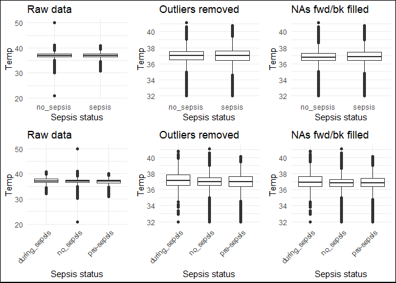
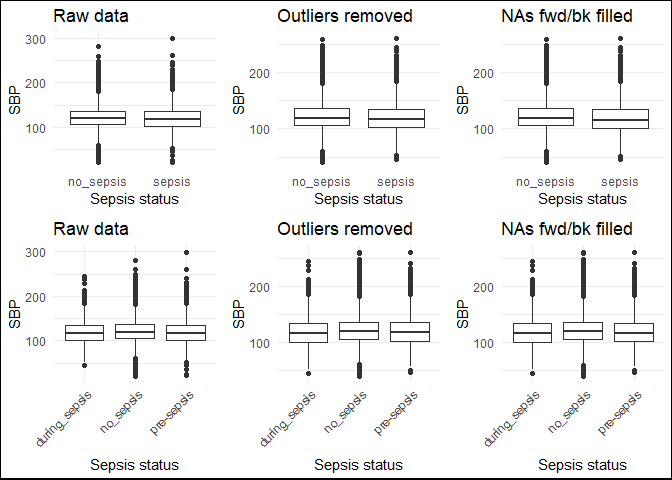

data_exploration
================
Lauren
2023-11-20

# BMEG 423/523 CDSS Assignment

## Initial Data Exploration

Team 2  
2023-11-20

The training and test data used in this project are from the 2019
PhysioNet Computing in Cardiology Challenge. More information about the
challenge can be found
[here](https://physionet.org/content/challenge-2019/1.0.0/).

This markdown file documents data exploration and analysis for the
training dataset. The results of this data analysis will guide the
design of a clinical decision support model for early prediction of
sepsis in ICU patients. This data exploration and analysis includes the
following:  
1. The raw training and test data, organized as separate files for each
patient, are merged into single csv files and loaded as data frames.  
2. Two additional categorical variables are added to the data to
stratify different sepsis “states”  
a) `LabelA` stratifies patients as `sepsis` (patients who developed
sepsis) and `no_sepsis` (patients who never developed sepsis).  
b) `LabelB` stratifies patients as `no_sepsis` (patients who never
developed sepsis), `pre-sepsis` (data for patients who eventually
developed sepsis prior to their positive diagnosis), and `during_sepsis`
(data for patients who developed sepsis after their positive
diagnosis).  
3. Mean values for each variable (vital sign/lab value) in the raw
dataset are calculated for the different sepsis states.  
4. Data is pre-processed  
a) Outlier values are removed  
b) NA values are filled by grouping by patient, forward filling, then
backward filling. An additional variable called `Shock` for shock index
(`HR/MAP`) is added to this dataset. Note that this variable was not
added to the versions of the dataset before NA filling to avoid diviison
by NA values. w 5. Box plots are generated for each variable to
visualize differences between the different sepsis states in the raw
dataset as well as the dataset with outliers removed and the dataset
with outliers removed and NA values filled.  
6. T-tests and ANOVA tests are performed to evaluate the significance of
differences in different variables (vital signs/lab values) between the
different sepsis states.  
7. Effect size testing using Cohen’s d-test is performed to further
evaluate the magnitude of differences in all variables between the
different sepsis states.

**Load packages required for data exploration and analysis**

``` r
#LOAD REQUIRED PACKAGES
library(tidyverse)
library(gridExtra)
library(kableExtra)
```

    ## Warning: package 'kableExtra' was built under R version 4.3.2

``` r
library(grid)
library(car)
```

    ## Warning: package 'car' was built under R version 4.3.2

    ## Warning: package 'carData' was built under R version 4.3.2

### 1. Merge the raw training and test data and save as an RData file

``` r
#FUNCTION TO MERGE ALL TRAINING CASES INTO ONE DATAFRAME AND SAVE AS RData FILE AND MERGE ALL TEST CASES INTO ANOTHER DATAFRAME # This code is based on code provided in the assignment package
load_cinc_data <- function(fromfile = T){
  #IF THE MERGED DATA FILE ALREADY EXISTS, JUST LOAD IT IN
  if (fromfile == T){
    load("CinC.RData")
  } 
  
  else {
    #CREATE A FILE CALLED CINC.Rdata TO HOLD THE MERGED TRAINING DATA FROM ALL PATIENTS WITH A COLUMN ADDED FOR PATIENT ID
    files <- list.files(here::here("training_2023-11-05"), full.names = TRUE) #creates character vector of the names of files in the training data folder
    cinc_dat <- NULL #initialize data frame to hold all patient data
    for (f in files){
      fname <- substr(basename(f), 1, nchar(basename(f))-4) #basically just removes ".csv" from the file names
      #print(fname)
      pdat <- read.delim(f, sep = ",", na = "NA") #create temp variable called pdat that contains a data frame read in from the patient data csv file
      pdat <- cbind(patient = fname, pdat) #adds a column to the data frame with the patient ID
      cinc_dat <- rbind(cinc_dat, pdat) #add data for current patient to data frame with all patient data (bind by row)
    }
    # Save the data
    save(cinc_dat, file = "CinC.RData")
    
    #CREATE A FILE CALLED CINC_Test.Rdata TO HOLD THE MERGED TEST DATA FROM ALL PATIENTS WITH A COLUMN ADDED FOR PATIENT ID
    files <- list.files(here::here("testing_2023-11-05"), full.names = TRUE)
    cinc_dat_test <- NULL
    for (f in files){
      fname <- substr(basename(f), 1, nchar(basename(f))-4)
      #print(fname)
      pdat <- read.delim(f, sep = ",", na = "NA")
      pdat <- cbind(patient = fname, pdat)
      cinc_dat_test <- rbind(cinc_dat_test, pdat)
    }
    # Save the data
    save(cinc_dat_test, file = "CinC_Test.RData")
  }
  return(cinc_dat)
}
```

**Load the merged data to a data frame in the working environment**

``` r
#cinc_data <- load_cinc_data(fromfile = F) #run this to merge data and save RData files if they don't exist yet
cinc_data <- load_cinc_data() #run this to load merged training data into a data frame called cinc_data if the RData files already exist
```

### 2. Groom the data - add additional labels to specify sepsis “state”

``` r
#Get vector with all patient IDs
patientIDs <- cinc_data %>%
  select(patient) %>%
  distinct(patient)

#Get patient IDs for all patients with a positive sepsis label at some point
sepsis_patientIDs <- cinc_data %>%
  filter(SepsisLabel == 1) %>%
  distinct(patient)

#Get patient IDs for all patients who never developed sepsis
no_sepsis_patientIDs <- anti_join(patientIDs, sepsis_patientIDs, by = "patient")

#Data frame with all data for patients with a positive sepsis label at some point
sepsis <- cinc_data %>%
  filter(patient %in% sepsis_patientIDs[[1]])

#Data frame with all data for patients who never developed sepsis
no_sepsis <- cinc_data %>%
  filter(patient %in% no_sepsis_patientIDs[[1]])
```

### 3. Calculate mean values for the raw dataset

In the summary table called `means`, I have computed the mean value of
each vital sign/lab value in the dataset for the following patient
groups: - All data for sepsis patients, including data before **and**
after positive sepsis diagnosis  
- Data for sepsis patients after their positive sepsis diagnosis (only
including rows of data where `SepsisLabel` = 1)  
- Data for sepsis patients before their positive sepsis diagnosis (only
including rows of data where `SepsisLabel` = 0)  
- All data for patients who never developed sepsis (patients for which
`SepsisLabel` = 0 throughout their ICU stay)

These mean values were calculated prior to outlier removal and NA
filling. NA values were excluded from the computations here.

| Demographic                                                                 | mean_HR | mean_O2sat | mean_Temp | mean_SBP | mean_MAP | mean_DBP | mean_Resp | mean_FiO2 | mean_pH | mean_BUN | mean_Creatinine | mean_Glucose | mean_Magnesium | mean_Potassium | mean_Hct | mean_Hgb | mean_WBC | mean_Age |
|:----------------------------------------------------------------------------|:--------|:-----------|:----------|:---------|:---------|:---------|:----------|:----------|:--------|:---------|:----------------|:-------------|:---------------|:---------------|:---------|:---------|:---------|:---------|
| All data for sepsis-positive patients before and after positive SepsisLabel | 89.941  | 96.844     | 36.981    | 119.78   | 79.921   | 62.114   | 20.165    | 0.53338   | 7.3718  | 33.229   | 1.9702          | 135.38       | 2.1050         | 4.2015         | 29.839   | 9.9916   | 13.378   | 62.254   |
| Data for sepsis-positive patients after positive SepsisLabel                | 92.114  | 96.590     | 37.164    | 118.67   | 78.987   | 61.808   | 20.816    | 0.56260   | 7.3596  | 34.100   | 2.2350          | 136.38       | 2.0710         | 4.2554         | 29.984   | 9.9888   | 14.461   | 62.098   |
| Data for sepsis-positive patients before positive SepsisLabel               | 89.573  | 96.888     | 36.953    | 119.97   | 80.079   | 62.161   | 20.058    | 0.52801   | 7.3744  | 33.054   | 1.9148          | 135.20       | 2.1112         | 4.1908         | 29.809   | 9.9922   | 13.151   | 62.280   |
| All data for sepsis-negative patients                                       | 85.356  | 97.147     | 36.993    | 122.30   | 81.683   | 63.065   | 18.827    | 0.53577   | 7.3761  | 23.652   | 1.5729          | 137.00       | 2.0628         | 4.1980         | 30.217   | 10.1528  | 11.523   | 62.692   |

### 4. Pre-Processing/data cleaning

#### a) Outlier removal

``` r
#Create copy of cinc_data with some added labels to help group the data based on sepsis state
cinc_data_1 <- cinc_data %>%
  mutate(LabelA = case_when(
    patient %in% no_sepsis_patientIDs[[1]] ~ "no_sepsis",
    patient %in% sepsis_patientIDs[[1]] ~ "sepsis"
  )) %>%
  mutate(LabelB = case_when(
    patient %in% no_sepsis_patientIDs[[1]] ~ "no_sepsis",
    SepsisLabel == 0 ~ "pre-sepsis",
    TRUE ~ "during_sepsis"
  ))

#Create table with min and max cutoffs
#Based on values reported by Firoozabadi & Babaeizadeh, 2019 (cinc.org/archives/2019/pdf/CinC2019-023.pdf)
minmax <- tribble(
  ~variable, ~min, ~max,
  "HR", 10, 300,
  "O2Sat", 60, 100,
  "Temp", 32, 42.2,
  "SBP", 40, 280,
  "MAP", 0, 300,
  "DBP", 20, 130,
  "Resp", 5, 60,
  "FiO2", 0, 1,
  "pH", 6, 8,
  "BUN", 0, 500,
  "Creatinine", 0, 10,
  "Glucose", 0, 1000,
  "Magnesium", 0, 10,
  "Potassium", 1, 10,
  "Hct", 10, 70,
  "Hgb", 2, 22,
  "WBC", 0, 50,
  "Age", 0, 150
)

#Replace outliers with NA using the min and max values in minmax
cinc_data_2 <- cinc_data_1
for (i in 1:18) {
  cinc_data_2[minmax[[1]][i]][cinc_data_2[minmax[[1]][i]] < minmax[[2]][i] | 
                                cinc_data_2[minmax[[1]][i]] >   minmax[[3]][i]] <- NA
}
```

#### b) Filling in NA values

- Start with the data frame in which outliers have been removed  
- Group by patient  
- Then, forward fill to replace most NA values with the last non-NA
  value  
- Then, backward fill to replace NA values at the beginning of each
  patient’s dataset that were before the first recorded non-NA values  
- If a variable was never measured for a given patient, leave this as NA
  and ignore NA values in subsequent analyses. Alternatively, these
  remaining NA values could be replaced by a population mean.  
- Add a variable called `Shock` for the shock index = `HR/MAP`

``` r
#Make a data frame called cinc_data_3 in which NA values have been replaced
cinc_data_3 <- cinc_data_2
cinc_data_3 <- cinc_data_3 %>%
  group_by(patient) %>%
  fill(everything(), .direction = "downup") %>%
  ungroup()
cinc_data_3 <- as.data.frame(cinc_data_3)

#Add shock index
cinc_data_3 <- cinc_data_3 %>%
  mutate(Shock = HR/MAP) %>%
  select(patient, ICULOS, HR, O2Sat, Temp, SBP, MAP, DBP, Resp, FiO2, pH, BUN, Creatinine, 
         Glucose, Magnesium, Potassium, Hct, Hgb, WBC, Age, Shock, everything())
```

### 5. Plotting data as boxplots

In this section, boxplots have been created for each variable (vital
sign/biomarker) using each of the three versions of the training
dataset:  
- `cinc_data_1`: raw, merged dataset with labels added for sepsis state
(`LabelA`: `no_sepsis` vs. `sepsis`, `LabelB`: `no_sepsis`
vs. `pre-sepsis` vs. `during_sepsis`)  
- `cinc_data_2`: same as `cinc_data_1`, but with outliers removed based
on lower and upper bounds reported by [Firoozabadi & Babaeizadeh,
2019](cinc.org/archives/2019/pdf/CinC2019-023.pdf)  
- `cinc_data_3`: same as `cinc_data_2`, but with NA values removed by
first grouping by patient, forward filling, then back filling. For
patients for whom one or more vital signs were never measured, the
values are still left blank. Shock index (variable called `Shock`) was
also calculated in this dataset as `HR/MAP`.

Boxplots in which patients have been stratified into two or three sepsis
groups are included for each variable and dataset:  
- In the first boxplot, the two groups are `no_sepsis` and `sepsis`.  
- The `no_sepsis` group includes all data for patients who never
developed sepsis  
- The `sepsis` group includes all data for patients who developed sepsis
at some point (including data recorded before and after their sepsis
diagnosis)  
- In the second boxplot, the three groups are `no_sepsis`, `pre-sepsis`,
and `during_sepsis`  
- The `no_sepsis` group includes all data for patients who never
developed sepsis  
- The `pre-sepsis` group includes data for patients who eventually
developed sepsis when their `SepsisLabel` was still 0 (before the
positive sepsis diagnosis)  
- The `during_sepsis` group includes data for patients who eventually
developed sepsis when their `SepsisLabel` was 1 (after the positive
sepsis diagnosis)

``` r
#Loop for plotting boxplots for all of the variables
for (i in 3:20){
p1 <- cinc_data_1 %>% ggplot(aes(x = LabelA, y = cinc_data_1[,i])) +
  geom_boxplot(na.rm = TRUE) +
  xlab("Sepsis status") +
  ylab(names(cinc_data_1[i])) +
  ggtitle("Raw data") +
  theme_minimal()
p2 <- cinc_data_1 %>% ggplot(aes(x = LabelB, y = cinc_data_1[,i])) +
  geom_boxplot(na.rm = TRUE) +
  xlab("Sepsis status") +
  ylab(names(cinc_data_1[i])) +
  ggtitle("Raw data") +
  theme_minimal() +
  scale_x_discrete(guide = guide_axis(angle = 45))

#outliers removed
p3 <- cinc_data_2 %>% ggplot(aes(x = LabelA, y = cinc_data_2[,i])) +
  geom_boxplot(na.rm = TRUE) +
  xlab("Sepsis status") +
  ylab(names(cinc_data_2[i])) +
  ggtitle("Outliers removed") +
  theme_minimal()
p4 <- cinc_data_2 %>% ggplot(aes(x = LabelB, y = cinc_data_2[,i])) +
  geom_boxplot(na.rm = TRUE) +
  xlab("Sepsis status") +
  ylab(names(cinc_data_2[i])) +
  ggtitle("Outliers removed") +
  theme_minimal() +
  scale_x_discrete(guide = guide_axis(angle = 45))

#outliers removed and NA values forward and back filled
p5 <- cinc_data_3 %>% ggplot(aes(x = LabelA, y = cinc_data_3[,i])) +
  geom_boxplot(na.rm = TRUE) +
  xlab("Sepsis status") +
  ylab(names(cinc_data_3[i])) +
  ggtitle("NAs fwd/bk filled") +
  theme_minimal()
p6 <- cinc_data_3 %>% ggplot(aes(x = LabelB, y = cinc_data_3[,i])) +
  geom_boxplot(na.rm = TRUE) +
  xlab("Sepsis status") +
  ylab(names(cinc_data_3[i])) +
  ggtitle("NAs fwd/bk filled") +
  theme_minimal() +
  scale_x_discrete(guide = guide_axis(angle = 45))

grid.arrange(p1, p3, p5, p2, p4, p6, nrow = 2, heights = c(4, 5))
grid.rect(width = 1, height = 1, gp = gpar(lwd = 2, col = "black", fill = NA))
}
```

<!-- --><!-- --><!-- --><!-- --><!-- --><!-- --><!-- --><!-- --><!-- --><!-- --><!-- --><!-- --><!-- --><!-- --><!-- --><!-- --><!-- --><!-- -->

``` r
#Also plot shock index for the dataset in which outliers have been removed and NAs have been filled
p7 <- cinc_data_3 %>% ggplot(aes(x = LabelA, y = Shock)) +
  geom_boxplot(na.rm = TRUE) +
  xlab("Sepsis status") +
  ylab("Shock index") +
  ggtitle("NAs fwd/bk filled") +
  theme_minimal()
p8 <- cinc_data_3 %>% ggplot(aes(x = LabelB, y = Shock)) +
  geom_boxplot(na.rm = TRUE) +
  xlab("Sepsis status") +
  ylab("Shock index") +
  ggtitle("NAs fwd/bk filled") +
  theme_minimal()

grid.arrange(p7, p8, nrow = 1)
grid.rect(width = 1, height = 1, gp = gpar(lwd = 2, col = "black", fill = NA))
```

<!-- -->

### 6. Significance Testing

In this section, I performed t-tests and ANOVA tests to check the
significance of variation in different variables in the patient data due
to sepsis. T-tests were performed to compare the no sepsis vs. sepsis
groups (e.g., all data for patients who never developed sepsis vs. all
data for patients who eventually developed sepsis). ANOVA tests were
used to compare the no sepsis vs. pre-sepsis and during sepsis groups.
Significance was evaluated based on p-values. Levine tests were done
prior to t-tests and ANOVA tests to evaluate if variances were equal or
not to inform the way in which R’s t-test and ANOVA functions were
applied to the dataset. Namely, if the Levine test p-value was less than
0.05, `var.equal` was set to `FALSE` in the t-test/ANOVA test. Results
are tabulated below for the raw data, data with outliers removed, and
data with outliers removed and NA values filled. In general, more
significant variables should have smaller p-values.

**Note:** this type of significance testing is not typically the best
for large datasets like this, as p-values depend on the sample size. See
the section below on effect size testing for more valuable information.

#### a) Using raw data before removing outliers

Results are saved in the statistics variable. In the table summarizing
the results below, vital signs/lab values are arranged in descending
order of significance (ascending p-values) based on the t-test comparing
no sepsis vs. sepsis patients.

``` r
#SIGNIFICANCE TESTING FOR RAW DATA BEFORE REMOVING OUTLIERS
variables <- names(cinc_data[3:20])

levene_pval_2groups <- NULL
ttest_pval_2groups <- NULL
levene_pval_3groups <- NULL
anova_pval_3groups <- NULL

#FOR DATA BEFORE OUTLIER REMOVAL
for (i in 3:20) {
  #Levene's test for data stratified based on no sepsis and sepsis
  #A p-value less than significance suggests that variances are not equal
  levene_temp_2groups <- leveneTest(cinc_data_1[, i] ~ LabelA, data = cinc_data_1)
  
  #Perform t-test for data stratified based on no sepsis and sepsis 
  if (levene_temp_2groups$`Pr(>F)`[1] < 0.05) { #Variances are not equal
    ttest_temp_2groups <- t.test(cinc_data_1[, i] ~ LabelA, data = cinc_data_1, var.equal = FALSE, na.action = na.omit)
  }
  else { #Variances are equal
    ttest_temp_2groups <- t.test(cinc_data_1[, i] ~ LabelA, data = cinc_data_1, var.equal = TRUE, na.action = na.omit)
  }
  
  #Levene's test for data stratified based on no sepsis, pre-sepsis, and during sepsis
  #A p-value less than significance suggests that variances are not equal
  levene_temp_3groups <- leveneTest(cinc_data_1[, i] ~ LabelB, data = cinc_data_1)
  
  #Perform 1-way ANOVA for data stratified based on no sepsis, pre-sepsis, and during sepsis
  if (levene_temp_3groups$`Pr(>F)`[1] < 0.05) { #Variances are not equal
    anova_temp_3groups <- oneway.test(cinc_data_1[, i] ~ LabelB, data = cinc_data_1, var.equal = FALSE, na.action = na.omit)
  }
  else { #Variances are equal
    anova_temp_3groups <- oneway.test(cinc_data_1[, i] ~ LabelB, data = cinc_data_1, var.equal = TRUE, na.action = na.omit)
  }
  
  #Extract the p-values from each test
  levene_pval_2groups <- rbind(levene_pval_2groups, levene_temp_2groups$`Pr(>F)`[1])
  ttest_pval_2groups <- rbind(ttest_pval_2groups, ttest_temp_2groups$p.value)
  levene_pval_3groups <- rbind(levene_pval_3groups, levene_temp_3groups$`Pr(>F)`[1])
  anova_pval_3groups <- rbind(anova_pval_3groups, anova_temp_3groups$p.value)
}

#Put data in correct format
statistics <- cbind(variables, levene_pval_2groups, ttest_pval_2groups, levene_pval_3groups,anova_pval_3groups)

statistics <- as.data.frame(statistics)
colnames(statistics) <- (c("variables", "levene_pval_2groups", "ttest_pval_2groups",
                           "levene_pval_3groups", "anova_pval_3groups"))
statistics$levene_pval_2groups <- as.double(statistics$levene_pval_2groups)
statistics$ttest_pval_2groups <- as.double(statistics$ttest_pval_2groups)
statistics$levene_pval_3groups <- as.double(statistics$levene_pval_3groups)
statistics$anova_pval_3groups <- as.double(statistics$anova_pval_3groups)

#Arrange data in ascending order of ttest_pval_2groups and print the table
table <- statistics %>%
  arrange(ttest_pval_2groups)
kable(format(table, digits = 3), format = "markdown")
```

| variables  | levene_pval_2groups | ttest_pval_2groups | levene_pval_3groups | anova_pval_3groups |
|:-----------|:--------------------|:-------------------|:--------------------|:-------------------|
| HR         | 2.76e-111           | 0.00e+00           | 3.42e-106           | 0.00e+00           |
| Resp       | 1.84e-288           | 3.57e-284          | 6.44e-293           | 8.15e-278          |
| BUN        | 1.29e-57            | 1.35e-81           | 1.19e-56            | 4.35e-73           |
| MAP        | 7.74e-05            | 1.37e-72           | 3.97e-07            | 2.59e-73           |
| SBP        | 2.44e-26            | 1.27e-63           | 3.82e-26            | 2.20e-63           |
| O2Sat      | 6.34e-56            | 3.66e-53           | 1.71e-63            | 6.41e-55           |
| DBP        | 1.34e-06            | 2.23e-25           | 1.47e-07            | 2.25e-24           |
| Creatinine | 1.98e-13            | 3.43e-19           | 1.17e-13            | 4.78e-18           |
| WBC        | 2.98e-11            | 9.00e-13           | 1.99e-12            | 1.10e-11           |
| Magnesium  | 3.31e-01            | 2.40e-07           | 9.82e-02            | 2.01e-07           |
| Age        | 1.02e-14            | 4.24e-06           | 1.03e-13            | 1.94e-05           |
| Hgb        | 2.12e-06            | 2.03e-05           | 4.82e-09            | 1.13e-04           |
| Hct        | 3.90e-03            | 1.78e-04           | 1.55e-06            | 5.50e-04           |
| pH         | 1.22e-56            | 6.12e-03           | 6.68e-56            | 3.19e-05           |
| Glucose    | 8.76e-01            | 1.39e-02           | 1.66e-02            | 3.16e-02           |
| Temp       | 4.16e-130           | 1.48e-01           | 2.17e-143           | 3.32e-16           |
| FiO2       | 3.18e-01            | 4.76e-01           | 1.68e-03            | 6.54e-05           |
| Potassium  | 1.02e-09            | 7.59e-01           | 5.39e-11            | 1.02e-01           |

#### b) Using raw data after removing outliers

Results are saved in the statistics_outliers_removed variable. In the
table summarizing the results below, vital signs/lab values are arranged
in descending order of significance (ascending p-values) based on the
t-test comparing no sepsis vs. sepsis patients.

``` r
#SIGNIFICANCE TESTING OF DATA AFTER REMOVING OUTLIERS
variables <- names(cinc_data[3:20])

levene_pval_2groups <- NULL
ttest_pval_2groups <- NULL
levene_pval_3groups <- NULL
anova_pval_3groups <- NULL

#FOR DATA AFTER OUTLIER REMOVAL
for (i in 3:20) {
  #Levene's test for data stratified based on no sepsis and sepsis
  #A p-value less than significance suggests that variances are not equal
  levene_temp_2groups <- leveneTest(cinc_data_2[, i] ~ LabelA, data = cinc_data_2)
  
  #Perform t-test for data stratified based on no sepsis and sepsis 
  if (levene_temp_2groups$`Pr(>F)`[1] < 0.05) { #Variances are not equal
    ttest_temp_2groups <- t.test(cinc_data_2[, i] ~ LabelA, data = cinc_data_2, var.equal = FALSE, na.action = na.omit)
  }
  else { #Variances are equal
    ttest_temp_2groups <- t.test(cinc_data_2[, i] ~ LabelA, data = cinc_data_2, var.equal = TRUE, na.action = na.omit)
  }
  
  #Levene's test for data stratified based on no sepsis, pre-sepsis, and during sepsis
  #A p-value less than significance suggests that variances are not equal
  levene_temp_3groups <- leveneTest(cinc_data_2[, i] ~ LabelB, data = cinc_data_2)
  
  #Perform 1-way ANOVA for data stratified based on no sepsis, pre-sepsis, and during sepsis
  if (levene_temp_3groups$`Pr(>F)`[1] < 0.05) { #Variances are not equal
    anova_temp_3groups <- oneway.test(cinc_data_2[, i] ~ LabelB, data = cinc_data_2, var.equal = FALSE, na.action = na.omit)
  }
  else { #Variances are equal
    anova_temp_3groups <- oneway.test(cinc_data_2[, i] ~ LabelB, data = cinc_data_2, var.equal = TRUE, na.action = na.omit)
  }
  
  #Extract the p-values from each test
  levene_pval_2groups <- rbind(levene_pval_2groups, levene_temp_2groups$`Pr(>F)`[1])
  ttest_pval_2groups <- rbind(ttest_pval_2groups, ttest_temp_2groups$p.value)
  levene_pval_3groups <- rbind(levene_pval_3groups, levene_temp_3groups$`Pr(>F)`[1])
  anova_pval_3groups <- rbind(anova_pval_3groups, anova_temp_3groups$p.value)
}

#Put data in correct format
statistics_outliers_removed <- cbind(variables, levene_pval_2groups, ttest_pval_2groups, levene_pval_3groups,
                                     anova_pval_3groups)

statistics_outliers_removed <- as.data.frame(statistics_outliers_removed)
colnames(statistics_outliers_removed) <- (c("variables", "levene_pval_2groups", "ttest_pval_2groups",
                                            "levene_pval_3groups", "anova_pval_3groups"))
statistics_outliers_removed$levene_pval_2groups <- as.double(statistics_outliers_removed$levene_pval_2groups)
statistics_outliers_removed$ttest_pval_2groups <- as.double(statistics_outliers_removed$ttest_pval_2groups)
statistics_outliers_removed$levene_pval_3groups <- as.double(statistics_outliers_removed$levene_pval_3groups)
statistics_outliers_removed$anova_pval_3groups <- as.double(statistics_outliers_removed$anova_pval_3groups)

#Arrange data in ascending order of ttest_pval_2groups and print the table
table <- statistics_outliers_removed %>%
  arrange(ttest_pval_2groups)
kable(format(table, digits = 3), format = "markdown")
```

| variables  | levene_pval_2groups | ttest_pval_2groups | levene_pval_3groups | anova_pval_3groups |
|:-----------|:--------------------|:-------------------|:--------------------|:-------------------|
| HR         | 2.76e-111           | 0.00e+00           | 3.42e-106           | 0.00e+00           |
| Resp       | 3.48e-292           | 2.75e-302          | 1.95e-296           | 2.38e-295          |
| BUN        | 1.29e-57            | 1.35e-81           | 1.19e-56            | 4.35e-73           |
| MAP        | 7.74e-05            | 1.37e-72           | 3.97e-07            | 2.59e-73           |
| SBP        | 2.42e-26            | 3.47e-64           | 3.28e-26            | 6.39e-64           |
| O2Sat      | 3.27e-69            | 1.67e-58           | 4.59e-78            | 2.65e-60           |
| Creatinine | 5.32e-25            | 4.54e-30           | 6.61e-24            | 4.61e-28           |
| DBP        | 3.26e-07            | 1.06e-26           | 3.47e-08            | 1.09e-25           |
| WBC        | 1.54e-29            | 2.12e-23           | 1.12e-32            | 1.19e-21           |
| Magnesium  | 3.31e-01            | 2.40e-07           | 9.82e-02            | 2.01e-07           |
| Age        | 1.02e-14            | 4.24e-06           | 1.03e-13            | 1.94e-05           |
| Hgb        | 2.41e-06            | 2.30e-05           | 5.16e-09            | 1.27e-04           |
| Hct        | 4.56e-03            | 1.47e-04           | 1.72e-06            | 4.59e-04           |
| pH         | 1.22e-56            | 6.12e-03           | 6.68e-56            | 3.19e-05           |
| Glucose    | 8.76e-01            | 1.39e-02           | 1.66e-02            | 3.16e-02           |
| Temp       | 2.58e-138           | 1.72e-01           | 2.94e-153           | 8.12e-16           |
| FiO2       | 3.42e-01            | 3.96e-01           | 4.85e-03            | 1.53e-04           |
| Potassium  | 5.95e-10            | 7.78e-01           | 1.86e-11            | 8.80e-02           |

#### c) Using data with outliers removed and NAs forward- then back-filled

Results are saved in the statistics_filled variable. In the table
summarizing the results below, vital signs/lab values are arranged in
descending order of significance (ascending p-values) based on the
t-test comparing no sepsis vs. sepsis patients.

``` r
#SIGNIFICANCE TESTING OF DATA AFTER REMOVING OUTLIERS AND FILLING NA VALUES
variables <- names(cinc_data_3[3:21])

levene_pval_2groups <- NULL
ttest_pval_2groups <- NULL
levene_pval_3groups <- NULL
anova_pval_3groups <- NULL

#FOR DATA AFTER OUTLIER REMOVAL AND NA FILLING
for (i in 3:21) {
  #Levene's test for data stratified based on no sepsis and sepsis
  #A p-value less than significance suggests that variances are not equal
  levene_temp_2groups <- leveneTest(cinc_data_3[, i] ~ LabelA, data = cinc_data_3)
  
  #Perform t-test for data stratified based on no sepsis and sepsis 
  if (levene_temp_2groups$`Pr(>F)`[1] < 0.05) { #Variances are not equal
    ttest_temp_2groups <- t.test(cinc_data_3[, i] ~ LabelA, data = cinc_data_3, var.equal = FALSE, na.action = na.omit)
  }
  else { #Variances are equal
    ttest_temp_2groups <- t.test(cinc_data_3[, i] ~ LabelA, data = cinc_data_3, var.equal = TRUE, na.action = na.omit)
  }
  
  #Levene's test for data stratified based on no sepsis, pre-sepsis, and during sepsis
  #A p-value less than significance suggests that variances are not equal
  levene_temp_3groups <- leveneTest(cinc_data_3[, i] ~ LabelB, data = cinc_data_3)
  
  #Perform 1-way ANOVA for data stratified based on no sepsis, pre-sepsis, and during sepsis
  if (levene_temp_3groups$`Pr(>F)`[1] < 0.05) { #Variances are not equal
    anova_temp_3groups <- oneway.test(cinc_data_3[, i] ~ LabelB, data = cinc_data_3, var.equal = FALSE, na.action = na.omit)
  }
  else { #Variances are equal
    anova_temp_3groups <- oneway.test(cinc_data_3[, i] ~ LabelB, data = cinc_data_3, var.equal = TRUE, na.action = na.omit)
  }
  
  #Extract the p-values from each test
  levene_pval_2groups <- rbind(levene_pval_2groups, levene_temp_2groups$`Pr(>F)`[1])
  ttest_pval_2groups <- rbind(ttest_pval_2groups, ttest_temp_2groups$p.value)
  levene_pval_3groups <- rbind(levene_pval_3groups, levene_temp_3groups$`Pr(>F)`[1])
  anova_pval_3groups <- rbind(anova_pval_3groups, anova_temp_3groups$p.value)
}

#Put data in correct format
statistics_filled <- cbind(variables, levene_pval_2groups, ttest_pval_2groups, levene_pval_3groups,
                                     anova_pval_3groups)

statistics_filled <- as.data.frame(statistics_filled)
colnames(statistics_filled) <- (c("variables", "levene_pval_2groups", "ttest_pval_2groups",
                                  "levene_pval_3groups", "anova_pval_3groups"))
statistics_filled$levene_pval_2groups <- as.double(statistics_filled$levene_pval_2groups)
statistics_filled$ttest_pval_2groups <- as.double(statistics_filled$ttest_pval_2groups)
statistics_filled$levene_pval_3groups <- as.double(statistics_filled$levene_pval_3groups)
statistics_filled$anova_pval_3groups <- as.double(statistics_filled$anova_pval_3groups)

#Arrange data in ascending order of ttest_pval_2groups and print the table
table <- statistics_filled %>%
  arrange(ttest_pval_2groups)
kable(format(table, digits = 3), format = "markdown")
```

| variables  | levene_pval_2groups | ttest_pval_2groups | levene_pval_3groups | anova_pval_3groups |
|:-----------|:--------------------|:-------------------|:--------------------|:-------------------|
| HR         | 5.01e-132           | 0.00e+00           | 4.09e-126           | 0.00e+00           |
| BUN        | 0.00e+00            | 0.00e+00           | 0.00e+00            | 0.00e+00           |
| Creatinine | 2.72e-315           | 0.00e+00           | 1.32e-314           | 9.08e-321          |
| Shock      | 9.10e-93            | 0.00e+00           | 1.70e-92            | 0.00e+00           |
| Resp       | 9.88e-324           | 1.43e-305          | 0.00e+00            | 2.30e-301          |
| WBC        | 2.90e-277           | 2.21e-273          | 2.23e-305           | 1.72e-262          |
| Hgb        | 7.12e-145           | 9.72e-204          | 1.71e-155           | 1.38e-196          |
| Hct        | 1.11e-155           | 4.54e-133          | 1.40e-170           | 3.31e-129          |
| SBP        | 1.98e-49            | 7.43e-131          | 2.62e-48            | 3.40e-127          |
| Magnesium  | 3.39e-01            | 8.97e-118          | 9.78e-07            | 5.74e-131          |
| MAP        | 5.63e-09            | 8.53e-110          | 7.51e-12            | 2.18e-108          |
| FiO2       | 1.32e-150           | 2.25e-89           | 3.26e-151           | 6.22e-90           |
| O2Sat      | 4.90e-79            | 1.52e-64           | 4.05e-86            | 2.14e-66           |
| DBP        | 6.92e-08            | 2.67e-32           | 2.04e-08            | 4.66e-31           |
| Temp       | 0.00e+00            | 1.31e-16           | 0.00e+00            | 6.38e-29           |
| pH         | 3.46e-322           | 1.29e-07           | 8.24e-320           | 1.10e-13           |
| Age        | 1.02e-14            | 4.24e-06           | 1.03e-13            | 1.94e-05           |
| Glucose    | 6.71e-04            | 3.98e-02           | 1.30e-09            | 1.02e-03           |
| Potassium  | 9.26e-70            | 2.08e-01           | 5.99e-70            | 7.52e-02           |

The p-values calculated for all three versions of the dataset show
similar trends in terms of which variables are most significantly
associated with sepsis state. All results highlight that HR, Resp, and
BUN have high significance. The results for the raw dataset and dataset
with outliers removed are very similar, while results are slightly
different for the dataset with outliers removed and NAs filled.
Additionally, the significance levels are generally higher in the
dataset with filling, likley because this increases the sample sizes.

As we plan to use outlier removal and NA filling in the CDSS model, the
results for this dataset are likely most informative for guiding the
selection of variables to include/exclude in the model. From these
results, we can also see that shock index might be a strong predictor of
sepsis.

### 7. Effect size testing

Significance testing with p-values can give misleading results when the
dataset is extremely large. Namely, when the dataset is very large, even
a tiny effect might be interpreted as significant. Statistical
significance is effected by the sample size, and increasing sample size
always makes it more likely to get a statistically significant effect.
As stated by [Nakagawa & Cuthill,
2007](https://onlinelibrary.wiley.com/doi/full/10.1111/j.1469-185X.2007.00027.x?casa_token=tR9tBq2c9kUAAAAA%3A9H_DGj5JmeUWMjt8dlik2N93nRovIHOMRYS6NiVQXcA0XpCjJkm1u1U3mvKx_gm_WKw9v2h_P259DbA),
“with sufficient measurement precision and a large enough sample size
one can always obtain a (statistically) non-zero effect.” Effect sizes
represent the practical significance - is the effect large enough to
matter in the real world? Effect size depends only on the data and not
on the size of the sample, making it a more appropriate metric when
dealing with very large datasets
[ref](https://www.scribbr.com/statistics/effect-size/#:~:text=Effect%20size%20tells%20you%20how,size%20indicates%20limited%20practical%20applications.).

Cohen’s d-test is the method I have chosen to analyze effect sizes in
this dataset
\[[ref1](https://onlinelibrary.wiley.com/doi/full/10.1111/j.1469-185X.2007.00027.x?casa_token=tR9tBq2c9kUAAAAA%3A9H_DGj5JmeUWMjt8dlik2N93nRovIHOMRYS6NiVQXcA0XpCjJkm1u1U3mvKx_gm_WKw9v2h_P259DbA),
[ref2](https://www.ncbi.nlm.nih.gov/pmc/articles/PMC5133225/)\]. The *d*
value is a measure of how many standard deviations lie between the means
of two groups. A *d* value with a magnitude of 0.2 is generally
considered to represent a small effect, 0.5 is a medium effect, and 0.8
or greater is a large effect. This test can only be used to compare 2
different groups at a time. As such, I will structure this analysis as
follows:  
- I will calculate *d* for each variable to find the effect size between
the no sepsis and sepsis groups (i.e., all patients who never developed
sepsis vs. all patients who eventually developed sepsis)  
- I will then calculate *d* for each variable to find the effect size
between the no sepsis group and the  
- Pre-sepsis group (data for patients who developed sepsis while
SepsisLabel is still 0)  
- During sepsis group (data for patients who developed sepsis while
SepsisLabel is 1)

Note that the sign of d (negative vs. positive) just depends on which
group’s mean is greater.  
I will calculate these values for the raw data as well as the data after
outlier removal and the data after outlier removal and NA filling. Also
note that the d-test calculation assumes that the different groups have
equal variances (reasonable assumption if the variance of group 1 is
between 0.5 and 2 times the variance of group 2). I did not assess this
in detail, so it may not be completely true.

#### a) Raw Data

``` r
#EFFECT SIZE ANALYSIS
#Raw data
variables <- names(cinc_data[3:20])

no_sepsis_mean <- NULL
sepsis_mean <- NULL
pre_sepsis_mean <- NULL
during_sepsis_mean <- NULL

no_sepsis_sd <- NULL
sepsis_sd <- NULL
pre_sepsis_sd <- NULL
during_sepsis_sd <- NULL

d_no_sepsis_v_sepsis <- NULL
d_no_sepsis_v_pre_sepsis <- NULL
d_no_sepsis_v_during_sepsis <- NULL
d_pre_sepsis_v_during_sepsis <- NULL

for (i in 3:20) {
  #calculate means and standard deviations for each population
  msd_1 <- cinc_data_1 %>% #no-sepsis group
    filter(LabelA == "no_sepsis")
  n_1 <- msd_1 %>%
    filter(!is.na(msd_1[, i])) %>%
    summarise(n = n())
  n_1 <- n_1[, 1] #sample size
  msd_1 <- msd_1 %>%
    summarise(mean = mean(msd_1[, i], na.rm = TRUE), sd = sd(msd_1[, i], na.rm = TRUE))
  m_1 <- msd_1[,1] #mean
  sd_1 <- msd_1[,2] #standard deviation

  
  msd_2 <- cinc_data_1 %>% #sepsis group (all data)
    filter(LabelA == "sepsis")
  n_2 <- msd_2 %>%
    filter(!is.na(msd_2[, i])) %>%
    summarise(n = n())
  n_2 <- n_2[, 1] #sample size
  msd_2 <- msd_2 %>%
    summarise(mean = mean(msd_2[, i], na.rm = TRUE), sd = sd(msd_2[, i], na.rm = TRUE))
  m_2 <- msd_2[,1] #mean
  sd_2 <- msd_2[,2] #standard deviation
  
  msd_3 <- cinc_data_1 %>% #pre-sepsis group
    filter(LabelB == "pre-sepsis") 
  n_3 <- msd_3 %>%
    filter(!is.na(msd_3[, i])) %>%
    summarise(n = n())
  n_3 <- n_3[, 1] #sample size
  msd_3 <- msd_3 %>%
    summarise(mean = mean(msd_3[, i], na.rm = TRUE), sd = sd(msd_3[, i], na.rm = TRUE))
  m_3 <- msd_3[,1] #mean
  sd_3 <- msd_3[,2] #standard deviation
  
  msd_4 <- cinc_data_1 %>% #during sepsis group
    filter(LabelB == "during_sepsis")
  n_4 <- msd_4 %>%
    filter(!is.na(msd_4[, i])) %>%
    summarise(n = n())
  n_4 <- n_4[, 1] #sample size
  msd_4 <- msd_4 %>%
    summarise(mean = mean(msd_4[, i], na.rm = TRUE), sd = sd(msd_4[, i], na.rm = TRUE))
  m_4 <- msd_4[,1] #mean
  sd_4 <- msd_4[,2] #standard deviation
  
  #Calculate d-tests
  d_12 <- (m_2 - m_1)/(sqrt(((n_2 - 1)*sd_2^2 + (n_1 - 1)*sd_1^2)/(n_2 + n_1 - 2))) #difference b/w no-sepsis and sepsis
  d_13 <- (m_3 - m_1)/(sqrt(((n_3 - 1)*sd_3^2 + (n_1 - 1)*sd_1^2)/(n_3 + n_1 - 2))) #difference b/w no-sepsis and pre-sepsis
  d_14 <- (m_4 - m_1)/(sqrt(((n_4 - 1)*sd_4^2 + (n_1 - 1)*sd_1^2)/(n_4 + n_1 - 2))) #difference b/w no-sepsis and during sepsis
  d_34 <- (m_4 - m_3)/(sqrt(((n_4 - 1)*sd_4^2 + (n_3 - 1)*sd_3^2)/(n_4 + n_3 - 2))) #difference b/w pre-sepsis and during sepsis
  
  no_sepsis_mean <- rbind(no_sepsis_mean, m_1[1])
  sepsis_mean <- rbind(sepsis_mean, m_2[1])
  pre_sepsis_mean <- rbind(pre_sepsis_mean, m_3[1])
  during_sepsis_mean <- rbind(during_sepsis_mean, m_4[1])
  
  no_sepsis_sd <- rbind(no_sepsis_sd, sd_1[1])
  sepsis_sd <- rbind(sepsis_sd, sd_2[1])
  pre_sepsis_sd <- rbind(pre_sepsis_sd, sd_3[1])
  during_sepsis_sd <- rbind(during_sepsis_sd, sd_4[1])
  
  d_no_sepsis_v_sepsis <- rbind(d_no_sepsis_v_sepsis, d_12[1])
  d_no_sepsis_v_pre_sepsis <- rbind(d_no_sepsis_v_pre_sepsis, d_13[1])
  d_no_sepsis_v_during_sepsis <- rbind(d_no_sepsis_v_during_sepsis, d_14[1])
  d_pre_sepsis_v_during_sepsis <- rbind(d_pre_sepsis_v_during_sepsis, d_34[1])
}

dtest <- cbind(variables, no_sepsis_mean, no_sepsis_sd, sepsis_mean, sepsis_sd, pre_sepsis_mean, pre_sepsis_sd,
               during_sepsis_mean, during_sepsis_sd, d_no_sepsis_v_sepsis, d_no_sepsis_v_pre_sepsis,
               d_no_sepsis_v_during_sepsis, d_pre_sepsis_v_during_sepsis)

dtest <- as.data.frame(dtest)

colnames(dtest) <- (c("variables", "no sepsis, mean", "no sepsis, sd", "sepsis, mean", "sepsis, sd", 
                      "pre-sepsis, mean", "pre-sepsis, sd", "during sepsis, mean", "during sepsis, sd", 
                      "no sepsis vs. sepsis, d", "no sepsis vs. pre-sepsis, d", "no sepsis vs. during sepsis, d",
                      "pre-sepsis vs. during sepsis, d"))

for (i in 2:13) {
  dtest[,i] <- as.double(dtest[,i])
}

#dtest_means <- dtest %>% select(variables, `no sepsis, mean`, `sepsis, mean`, `pre-sepsis, mean`, `during sepsis, mean`)
#kable(format(dtest_means, digits = 3), format = "markdown")

#dtest_sd <- dtest %>% select(variables, `no sepsis, sd`, `sepsis, sd`, `pre-sepsis, sd`, `during sepsis, sd`)
#kable(format(dtest_sd, digits = 3), format = "markdown")

dtest_d <- dtest %>% select(variables, `no sepsis vs. sepsis, d`, `no sepsis vs. pre-sepsis, d`, 
                            `no sepsis vs. during sepsis, d`, `pre-sepsis vs. during sepsis, d`)

#Order the data in descending order based on the d value for no sepsis vs. pre-sepsis
table <- dtest_d %>%
  mutate(`no sepsis vs. pre-sepsis, abs(d)` = abs(`no sepsis vs. pre-sepsis, d`)) %>%
  arrange(desc(`no sepsis vs. pre-sepsis, abs(d)`)) %>%
  select(-`no sepsis vs. pre-sepsis, abs(d)`)

kable(format(table, digits = 3), format = "markdown")
```

| variables  | no sepsis vs. sepsis, d | no sepsis vs. pre-sepsis, d | no sepsis vs. during sepsis, d | pre-sepsis vs. during sepsis, d |
|:-----------|:------------------------|:----------------------------|:-------------------------------|:--------------------------------|
| BUN        | 0.45911                 | 0.4548                      | 0.5267                         | 0.0419                          |
| HR         | 0.26685                 | 0.2462                      | 0.4005                         | 0.1357                          |
| Resp       | 0.25283                 | 0.2341                      | 0.3862                         | 0.1253                          |
| Creatinine | 0.20166                 | 0.1752                      | 0.3343                         | 0.1594                          |
| WBC        | 0.17372                 | 0.1555                      | 0.2809                         | 0.1063                          |
| Magnesium  | 0.10959                 | 0.1258                      | 0.0209                         | -0.1098                         |
| SBP        | -0.10885                | -0.1010                     | -0.1575                        | -0.0541                         |
| MAP        | -0.10893                | -0.0993                     | -0.1660                        | -0.0685                         |
| O2Sat      | -0.09895                | -0.0853                     | -0.1839                        | -0.0912                         |
| Hgb        | -0.08422                | -0.0842                     | -0.0847                        | -0.0018                         |
| Hct        | -0.06980                | -0.0756                     | -0.0427                        | 0.0327                          |
| DBP        | -0.06975                | -0.0663                     | -0.0915                        | -0.0268                         |
| Temp       | -0.01548                | -0.0503                     | 0.2185                         | 0.2274                          |
| FiO2       | -0.01159                | -0.0378                     | 0.1278                         | 0.1724                          |
| Glucose    | -0.03211                | -0.0356                     | -0.0123                        | 0.0239                          |
| Age        | -0.02720                | -0.0256                     | -0.0371                        | -0.0110                         |
| pH         | -0.05586                | -0.0219                     | -0.2271                        | -0.1657                         |
| Potassium  | 0.00545                 | -0.0111                     | 0.0886                         | 0.0924                          |

#### b) Outliers removed

``` r
#EFFECT SIZE ANALYSIS
#Outliers removed
variables <- names(cinc_data[3:20])

no_sepsis_mean <- NULL
sepsis_mean <- NULL
pre_sepsis_mean <- NULL
during_sepsis_mean <- NULL

no_sepsis_sd <- NULL
sepsis_sd <- NULL
pre_sepsis_sd <- NULL
during_sepsis_sd <- NULL

d_no_sepsis_v_sepsis <- NULL
d_no_sepsis_v_pre_sepsis <- NULL
d_no_sepsis_v_during_sepsis <- NULL
d_pre_sepsis_v_during_sepsis <- NULL

for (i in 3:20) {
  #calculate means and standard deviations for each population
  msd_1 <- cinc_data_2 %>% #no-sepsis group
    filter(LabelA == "no_sepsis")
  n_1 <- msd_1 %>%
    filter(!is.na(msd_1[, i])) %>%
    summarise(n = n())
  n_1 <- n_1[, 1] #sample size
  msd_1 <- msd_1 %>%
    summarise(mean = mean(msd_1[, i], na.rm = TRUE), sd = sd(msd_1[, i], na.rm = TRUE))
  m_1 <- msd_1[,1] #mean
  sd_1 <- msd_1[,2] #standard deviation
  
  msd_2 <- cinc_data_2 %>% #sepsis group (all data)
    filter(LabelA == "sepsis")
  n_2 <- msd_2 %>%
    filter(!is.na(msd_2[, i])) %>%
    summarise(n = n())
  n_2 <- n_2[, 1] #sample size
  msd_2 <- msd_2 %>%
    summarise(mean = mean(msd_2[, i], na.rm = TRUE), sd = sd(msd_2[, i], na.rm = TRUE))
  m_2 <- msd_2[,1] #mean
  sd_2 <- msd_2[,2] #standard deviation
  
  msd_3 <- cinc_data_2 %>% #pre-sepsis group
    filter(LabelB == "pre-sepsis") 
  n_3 <- msd_3 %>%
    filter(!is.na(msd_3[, i])) %>%
    summarise(n = n())
  n_3 <- n_3[, 1] #sample size
  msd_3 <- msd_3 %>%
    summarise(mean = mean(msd_3[, i], na.rm = TRUE), sd = sd(msd_3[, i], na.rm = TRUE))
  m_3 <- msd_3[,1] #mean
  sd_3 <- msd_3[,2] #standard deviation
  
  msd_4 <- cinc_data_2 %>% #during sepsis group
    filter(LabelB == "during_sepsis")
  n_4 <- msd_4 %>%
    filter(!is.na(msd_4[, i])) %>%
    summarise(n = n())
  n_4 <- n_4[, 1] #sample size
  msd_4 <- msd_4 %>%
    summarise(mean = mean(msd_4[, i], na.rm = TRUE), sd = sd(msd_4[, i], na.rm = TRUE))
  m_4 <- msd_4[,1] #mean
  sd_4 <- msd_4[,2] #standard deviation
  
  #Calculate d-tests
  #Calculate d-tests
  d_12 <- (m_2 - m_1)/(sqrt(((n_2 - 1)*sd_2^2 + (n_1 - 1)*sd_1^2)/(n_2 + n_1 - 2))) #difference b/w no-sepsis and sepsis
  d_13 <- (m_3 - m_1)/(sqrt(((n_3 - 1)*sd_3^2 + (n_1 - 1)*sd_1^2)/(n_3 + n_1 - 2))) #difference b/w no-sepsis and pre-sepsis
  d_14 <- (m_4 - m_1)/(sqrt(((n_4 - 1)*sd_4^2 + (n_1 - 1)*sd_1^2)/(n_4 + n_1 - 2))) #difference b/w no-sepsis and during sepsis
  d_34 <- (m_4 - m_3)/(sqrt(((n_4 - 1)*sd_4^2 + (n_3 - 1)*sd_3^2)/(n_4 + n_3 - 2))) #difference b/w pre-sepsis and during sepsis
  
  no_sepsis_mean <- rbind(no_sepsis_mean, m_1[1])
  sepsis_mean <- rbind(sepsis_mean, m_2[1])
  pre_sepsis_mean <- rbind(pre_sepsis_mean, m_3[1])
  during_sepsis_mean <- rbind(during_sepsis_mean, m_4[1])
  
  no_sepsis_sd <- rbind(no_sepsis_sd, sd_1[1])
  sepsis_sd <- rbind(sepsis_sd, sd_2[1])
  pre_sepsis_sd <- rbind(pre_sepsis_sd, sd_3[1])
  during_sepsis_sd <- rbind(during_sepsis_sd, sd_4[1])
  
  d_no_sepsis_v_sepsis <- rbind(d_no_sepsis_v_sepsis, d_12[1])
  d_no_sepsis_v_pre_sepsis <- rbind(d_no_sepsis_v_pre_sepsis, d_13[1])
  d_no_sepsis_v_during_sepsis <- rbind(d_no_sepsis_v_during_sepsis, d_14[1])
  d_pre_sepsis_v_during_sepsis <- rbind(d_pre_sepsis_v_during_sepsis, d_34[1])
}

dtest_outliers_removed <- cbind(variables, no_sepsis_mean, no_sepsis_sd, sepsis_mean, sepsis_sd, pre_sepsis_mean, pre_sepsis_sd,
                                during_sepsis_mean, during_sepsis_sd, d_no_sepsis_v_sepsis, d_no_sepsis_v_pre_sepsis,
                                d_no_sepsis_v_during_sepsis, d_pre_sepsis_v_during_sepsis)

dtest_outliers_removed <- as.data.frame(dtest_outliers_removed)

colnames(dtest_outliers_removed) <- (c("variables", "no sepsis, mean", "no sepsis, sd", "sepsis, mean", "sepsis, sd", 
                                       "pre-sepsis, mean", "pre-sepsis, sd", "during sepsis, mean", "during sepsis, sd", 
                                       "no sepsis vs. sepsis, d", "no sepsis vs. pre-sepsis, d", 
                                       "no sepsis vs. during sepsis, d", "pre-sepsis vs. during sepsis, d"))

for (i in 2:13) {
  dtest_outliers_removed[,i] <- as.double(dtest_outliers_removed[,i])
}

#dtest_outliers_removed_means <- dtest_outliers_removed %>% select(variables, `no sepsis, mean`, `sepsis, mean`, `pre-sepsis, mean`, `during sepsis, mean`)
#kable(format(dtest_outliers_removed_means, digits = 3), format = "markdown")

#dtest_outliers_removed_sd <- dtest_outliers_removed %>% select(variables, `no sepsis, sd`, `sepsis, sd`, `pre-sepsis, sd`,`during sepsis, sd`)
#kable(format(dtest_outliers_removed_sd, digits = 3), format = "markdown")

dtest_outliers_removed_d <- dtest_outliers_removed %>% select(variables, `no sepsis vs. sepsis, d`, 
                                                              `no sepsis vs. pre-sepsis, d`, `no sepsis vs. during sepsis, d`, 
                                                              `pre-sepsis vs. during sepsis, d`)

#Order the data in descending order based on the d value for no sepsis vs. pre-sepsis
table <- dtest_outliers_removed_d %>%
  mutate(`no sepsis vs. pre-sepsis, abs(d)` = abs(`no sepsis vs. pre-sepsis, d`)) %>%
  arrange(desc(`no sepsis vs. pre-sepsis, abs(d)`)) %>%
  select(-`no sepsis vs. pre-sepsis, abs(d)`)

kable(format(table, digits = 3), format = "markdown")
```

| variables  | no sepsis vs. sepsis, d | no sepsis vs. pre-sepsis, d | no sepsis vs. during sepsis, d | pre-sepsis vs. during sepsis, d |
|:-----------|:------------------------|:----------------------------|:-------------------------------|:--------------------------------|
| BUN        | 0.4591                  | 0.4548                      | 0.5267                         | 0.0419                          |
| Creatinine | 0.2733                  | 0.2579                      | 0.3621                         | 0.0901                          |
| HR         | 0.2669                  | 0.2462                      | 0.4005                         | 0.1357                          |
| Resp       | 0.2616                  | 0.2415                      | 0.4041                         | 0.1339                          |
| WBC        | 0.2503                  | 0.2357                      | 0.3536                         | 0.0931                          |
| Magnesium  | 0.1096                  | 0.1258                      | 0.0209                         | -0.1098                         |
| SBP        | -0.1093                 | -0.1014                     | -0.1581                        | -0.0544                         |
| MAP        | -0.1089                 | -0.0993                     | -0.1660                        | -0.0685                         |
| O2Sat      | -0.1054                 | -0.0912                     | -0.1947                        | -0.0936                         |
| Hgb        | -0.0838                 | -0.0837                     | -0.0843                        | -0.0018                         |
| Hct        | -0.0707                 | -0.0766                     | -0.0436                        | 0.0327                          |
| DBP        | -0.0715                 | -0.0679                     | -0.0945                        | -0.0284                         |
| Temp       | -0.0147                 | -0.0496                     | 0.2198                         | 0.2261                          |
| FiO2       | -0.0138                 | -0.0385                     | 0.1191                         | 0.1598                          |
| Glucose    | -0.0321                 | -0.0356                     | -0.0123                        | 0.0239                          |
| Age        | -0.0272                 | -0.0256                     | -0.0371                        | -0.0110                         |
| pH         | -0.0559                 | -0.0219                     | -0.2271                        | -0.1657                         |
| Potassium  | 0.0050                  | -0.0122                     | 0.0916                         | 0.0963                          |

#### c) Outliers removed and NAs filled

``` r
#EFFECT SIZE ANALYSIS
#Outliers removed and NA values filled
variables <- names(cinc_data_3[3:21])

no_sepsis_mean <- NULL
sepsis_mean <- NULL
pre_sepsis_mean <- NULL
during_sepsis_mean <- NULL

no_sepsis_sd <- NULL
sepsis_sd <- NULL
pre_sepsis_sd <- NULL
during_sepsis_sd <- NULL

d_no_sepsis_v_sepsis <- NULL
d_no_sepsis_v_pre_sepsis <- NULL
d_no_sepsis_v_during_sepsis <- NULL
d_pre_sepsis_v_during_sepsis <- NULL

for (i in 3:21) {
  #calculate means and standard deviations for each population
  msd_1 <- cinc_data_3 %>% #no-sepsis group
    filter(LabelA == "no_sepsis")
  n_1 <- msd_1 %>%
    filter(!is.na(msd_1[, i])) %>%
    summarise(n = n())
  n_1 <- n_1[, 1] #sample size
  msd_1 <- msd_1 %>%
    summarise(mean = mean(msd_1[, i], na.rm = TRUE), sd = sd(msd_1[, i], na.rm = TRUE))
  m_1 <- msd_1[,1] #mean
  sd_1 <- msd_1[,2] #standard deviation
  
  msd_2 <- cinc_data_3 %>% #sepsis group (all data)
    filter(LabelA == "sepsis")
  n_2 <- msd_2 %>%
    filter(!is.na(msd_2[, i])) %>%
    summarise(n = n())
  n_2 <- n_2[, 1] #sample size
  msd_2 <- msd_2 %>%
    summarise(mean = mean(msd_2[, i], na.rm = TRUE), sd = sd(msd_2[, i], na.rm = TRUE))
  m_2 <- msd_2[,1] #mean
  sd_2 <- msd_2[,2] #standard deviation
  
  msd_3 <- cinc_data_3 %>% #pre-sepsis group
    filter(LabelB == "pre-sepsis")
  n_3 <- msd_3 %>%
    filter(!is.na(msd_3[, i])) %>%
    summarise(n = n())
  n_3 <- n_3[, 1] #sample size
  msd_3 <- msd_3 %>%
    summarise(mean = mean(msd_3[, i], na.rm = TRUE), sd = sd(msd_3[, i], na.rm = TRUE))
  m_3 <- msd_3[,1] #mean
  sd_3 <- msd_3[,2] #standard deviation
  
  msd_4 <- cinc_data_3 %>% #during sepsis group
    filter(LabelB == "during_sepsis")
  n_4 <- msd_4 %>%
    filter(!is.na(msd_4[, i])) %>%
    summarise(n = n())
  n_4 <- n_4[, 1] #sample size
  msd_4 <- msd_4 %>%
    summarise(mean = mean(msd_4[, i], na.rm = TRUE), sd = sd(msd_4[, i], na.rm = TRUE))
  m_4 <- msd_4[,1] #mean
  sd_4 <- msd_4[,2] #standard deviation
  
  #Calculate d-tests
  #Calculate d-tests
  d_12 <- (m_2 - m_1)/(sqrt(((n_2 - 1)*sd_2^2 + (n_1 - 1)*sd_1^2)/(n_2 + n_1 - 2))) #difference b/w no-sepsis and sepsis
  d_13 <- (m_3 - m_1)/(sqrt(((n_3 - 1)*sd_3^2 + (n_1 - 1)*sd_1^2)/(n_3 + n_1 - 2))) #difference b/w no-sepsis and pre-sepsis
  d_14 <- (m_4 - m_1)/(sqrt(((n_4 - 1)*sd_4^2 + (n_1 - 1)*sd_1^2)/(n_4 + n_1 - 2))) #difference b/w no-sepsis and during sepsis
  d_34 <- (m_4 - m_3)/(sqrt(((n_4 - 1)*sd_4^2 + (n_3 - 1)*sd_3^2)/(n_4 + n_3 - 2))) #difference b/w pre-sepsis and during sepsis
  
  no_sepsis_mean <- rbind(no_sepsis_mean, m_1[1])
  sepsis_mean <- rbind(sepsis_mean, m_2[1])
  pre_sepsis_mean <- rbind(pre_sepsis_mean, m_3[1])
  during_sepsis_mean <- rbind(during_sepsis_mean, m_4[1])
  
  no_sepsis_sd <- rbind(no_sepsis_sd, sd_1[1])
  sepsis_sd <- rbind(sepsis_sd, sd_2[1])
  pre_sepsis_sd <- rbind(pre_sepsis_sd, sd_3[1])
  during_sepsis_sd <- rbind(during_sepsis_sd, sd_4[1])
  
  d_no_sepsis_v_sepsis <- rbind(d_no_sepsis_v_sepsis, d_12[1])
  d_no_sepsis_v_pre_sepsis <- rbind(d_no_sepsis_v_pre_sepsis, d_13[1])
  d_no_sepsis_v_during_sepsis <- rbind(d_no_sepsis_v_during_sepsis, d_14[1])
  d_pre_sepsis_v_during_sepsis <- rbind(d_pre_sepsis_v_during_sepsis, d_34[1])
}

dtest_filled <- cbind(variables, no_sepsis_mean, no_sepsis_sd, sepsis_mean, sepsis_sd, pre_sepsis_mean, pre_sepsis_sd,
                      during_sepsis_mean, during_sepsis_sd, d_no_sepsis_v_sepsis, d_no_sepsis_v_pre_sepsis,
                      d_no_sepsis_v_during_sepsis, d_pre_sepsis_v_during_sepsis)

dtest_filled <- as.data.frame(dtest_filled)

colnames(dtest_filled) <- (c("variables", "no sepsis, mean", "no sepsis, sd", "sepsis, mean", "sepsis, sd", 
                             "pre-sepsis, mean", "pre-sepsis, sd", "during sepsis, mean", "during sepsis, sd", 
                             "no sepsis vs. sepsis, d", "no sepsis vs. pre-sepsis, d", 
                             "no sepsis vs. during sepsis, d", "pre-sepsis vs. during sepsis, d"))

for (i in 2:13) {
  dtest_filled[,i] <- as.double(dtest_filled[,i])
}

#dtest_filled_means <- dtest_filled %>% select(variables, `no sepsis, mean`, `sepsis, mean`, `pre-sepsis, mean`, `during sepsis, mean`)
#kable(format(dtest_filled_means, digits = 3), format = "markdown")

#dtest_filled_sd <- dtest_filled %>% select(variables, `no sepsis, sd`, `sepsis, sd`, `pre-sepsis, sd`,`during sepsis, sd`)
#kable(format(dtest_filled_sd, digits = 3), format = "markdown")

dtest_filled_d <- dtest_filled %>% select(variables, `no sepsis vs. sepsis, d`, 
                                          `no sepsis vs. pre-sepsis, d`, `no sepsis vs. during sepsis, d`, 
                                          `pre-sepsis vs. during sepsis, d`)

#Order the data in descending order based on the d value for no sepsis vs. pre-sepsis
table <- dtest_filled_d %>%
  mutate(`no sepsis vs. pre-sepsis, abs(d)` = abs(`no sepsis vs. pre-sepsis, d`)) %>%
  arrange(desc(`no sepsis vs. pre-sepsis, abs(d)`)) %>%
  select(-`no sepsis vs. pre-sepsis, abs(d)`)

kable(format(table, digits = 3), format = "markdown")
```

| variables  | no sepsis vs. sepsis, d | no sepsis vs. pre-sepsis, d | no sepsis vs. during sepsis, d | pre-sepsis vs. during sepsis, d |
|:-----------|:------------------------|:----------------------------|:-------------------------------|:--------------------------------|
| BUN        | 0.43885                 | 0.4358                      | 0.5009                         | 0.0370                          |
| Shock      | 0.28474                 | 0.2611                      | 0.4415                         | 0.1577                          |
| Creatinine | 0.25299                 | 0.2498                      | 0.2871                         | 0.0281                          |
| HR         | 0.25771                 | 0.2367                      | 0.3968                         | 0.1385                          |
| Resp       | 0.24306                 | 0.2235                      | 0.3814                         | 0.1301                          |
| WBC        | 0.23532                 | 0.2212                      | 0.3533                         | 0.1070                          |
| Hgb        | -0.17125                | -0.1666                     | -0.1989                        | -0.0369                         |
| Magnesium  | 0.13643                 | 0.1491                      | 0.0520                         | -0.1006                         |
| SBP        | -0.14810                | -0.1460                     | -0.1640                        | -0.0163                         |
| FiO2       | 0.14382                 | 0.1363                      | 0.2080                         | 0.0588                          |
| Hct        | -0.13664                | -0.1325                     | -0.1609                        | -0.0331                         |
| MAP        | -0.12694                | -0.1196                     | -0.1705                        | -0.0531                         |
| O2Sat      | -0.10660                | -0.0945                     | -0.1861                        | -0.0800                         |
| DBP        | -0.07185                | -0.0697                     | -0.0856                        | -0.0173                         |
| pH         | 0.03963                 | 0.0542                      | -0.0685                        | -0.1009                         |
| Temp       | 0.05369                 | 0.0308                      | 0.1995                         | 0.1426                          |
| Age        | -0.02720                | -0.0256                     | -0.0371                        | -0.0110                         |
| Glucose    | -0.01182                | -0.0184                     | 0.0288                         | 0.0481                          |
| Potassium  | -0.00777                | -0.0121                     | 0.0197                         | 0.0293                          |

#### d) Discussion

In general, the variables with the greatest d values should be the
strongest predictors of sepsis. In particular, the most valuable d
values are likely the no sepsis vs. pre-sepsis values (i.e., which
variables change the most leading up to sepsis?), followed by no sepsis
vs. sepsis and no sepsis vs. during sepsis (i.e., which variables change
the most due to sepsis?). Moreover, for a good predictor of sepsis, we
would likely expect the d value for no sepsis vs. pre sepsis to be
smaller than the no sepsis vs. during sepsis (i.e., effects should be
more pronounced after diagnosis). If a variable has a small d value for
no sepsis vs. during sepsis, but a large d value for no sepsis
vs. pre-sepsis, it likely is not a good predictor and may not actually
be associated with sepsis. Similarly, if the d value for no sepsis
vs. pre-sepsis and no sepsis vs. during sepsis have different signs, it
also is likely not a good predictor.

From these results, the strongest and most consistent predictors of
sepsis from all 3 datasets appear to be the following:  
- BUN  
- HR  
- Resp  
- Creatinine  
- Shock  
- WBC

The following consistently appear to be poor predictors of sepsis:  
- Potassium (especially poor, as d-values have different signs for no
sepsis vs. pre-sepsis and no sepsis vs. during sepsis)  
- Glucose (especially poor, as d-values have different signs for no
sepsis vs. pre-sepsis and no sepsis vs. during sepsis)  
- Age  
- pH (especially poor, as d-values have different signs for no sepsis
vs. pre-sepsis and no sepsis vs. during sepsis)

We may also want to be careful about the use of Magnesium levels, as the
effect size is greater for the pre-sepsis group than the during sepsis
group compared to the no sepsis group. While temperature is a poor
predictor of pre-sepsis, it has a fairly large effect size when
comparing no sepsis vs. during sepsis. As such, it may still be useful
to include in the model.

As with the p-values, it is likely that the results for the dataset in
which outliers have been removed and NA values have been filled in is
the most informative for the design of our CDSS. Based on these results,
I might suggest testing the removal of all or some of the following
variables from the CDSS model generation (in order of priority of
removal):  
- Potassium  
- Glucose  
- pH  
- Age  
- Temp  
- Magnesium
