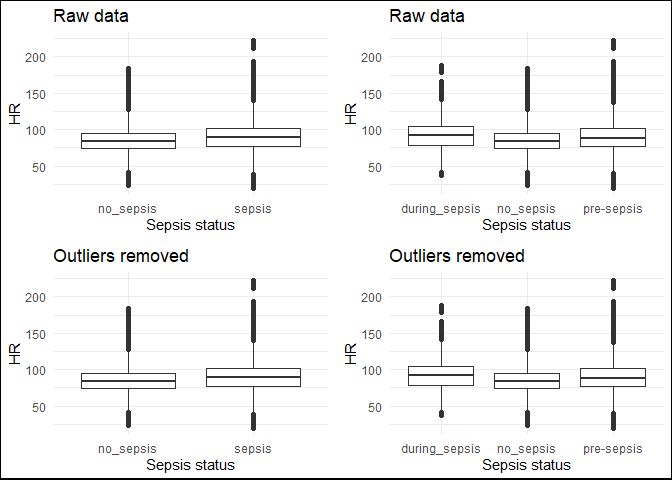

data_exploration
================
Lauren
2023-11-20

## BMEG 423/523 CDSS Assignment

### Initial Data Exploration

Team 2  
2023-11-20

The training and test data used in this project are from the 2019
PhysioNet Computing in Cardiology Challenge. More information about the
challenge can be found
[here](https://physionet.org/content/challenge-2019/1.0.0/).

This document includes the following:  
1. R code to merge all training cases into a single dataframe (which can
be easily exported to a csv)  
2. Plots illustrating the characteristics of the dataset  
b. Comparing patients who never had sepsis to those who didn’t have
sepsis initially, but developed it, and those who had sepsis from the
beginning of the dataset  
c. Characteristics of patient data 4-6 hours prior to sepsis diagnosis

``` r
#LOAD REQUIRED PACKAGES
library(tidyverse)
```

    ## ── Attaching core tidyverse packages ──────────────────────── tidyverse 2.0.0 ──
    ## ✔ dplyr     1.1.3     ✔ readr     2.1.4
    ## ✔ forcats   1.0.0     ✔ stringr   1.5.0
    ## ✔ ggplot2   3.4.3     ✔ tibble    3.2.1
    ## ✔ lubridate 1.9.2     ✔ tidyr     1.3.0
    ## ✔ purrr     1.0.2     
    ## ── Conflicts ────────────────────────────────────────── tidyverse_conflicts() ──
    ## ✖ dplyr::filter() masks stats::filter()
    ## ✖ dplyr::lag()    masks stats::lag()
    ## ℹ Use the conflicted package (<http://conflicted.r-lib.org/>) to force all conflicts to become errors

``` r
library(gridExtra)
```

    ## 
    ## Attaching package: 'gridExtra'
    ## 
    ## The following object is masked from 'package:dplyr':
    ## 
    ##     combine

``` r
library(grid)
```

#### Merge the raw training and test data and save as an RData file

``` r
#FUNCTION TO MERGE ALL TRAINING CASES INTO ONE DATAFRAME AND SAVE AS RData FILE AND MERGE ALL TEST CASES INTO ANOTHER DATAFRAME # This code is based on code provided in the assignment package
load_cinc_data <- function(fromfile = T){
  #IF THE MERGED DATA FILE ALREADY EXISTS, JUST LOAD IT IN
  if (fromfile == T){
    load("CinC.RData")
  } 
  
  else {
    #CREATE A FILE CALLED CINC.Rdata TO HOLD THE MERGED TRAINING DATA FROM ALL PATIENTS WITH A COLUMN ADDED FOR PATIENT ID
    files <- list.files(here::here("training_2023-11-05"), full.names = TRUE) #creates character vector of the names of files in the training data folder
    cinc_dat <- NULL #initialize data frame to hold all patient data
    for (f in files){
      fname <- substr(basename(f), 1, nchar(basename(f))-4) #basically just removes ".csv" from the file names
      #print(fname)
      pdat <- read.delim(f, sep = ",", na = "NA") #create temp variable called pdat that contains a data frame read in from the patient data csv file
      pdat <- cbind(patient = fname, pdat) #adds a column to the data frame with the patient ID
      cinc_dat <- rbind(cinc_dat, pdat) #add data for current patient to data frame with all patient data (bind by row)
    }
    # Save the data
    save(cinc_dat, file = "CinC.RData")
    
    #CREATE A FILE CALLED CINC_Test.Rdata TO HOLD THE MERGED TEST DATA FROM ALL PATIENTS WITH A COLUMN ADDED FOR PATIENT ID
    files <- list.files(here::here("testing_2023-11-05"), full.names = TRUE)
    cinc_dat_test <- NULL
    for (f in files){
      fname <- substr(basename(f), 1, nchar(basename(f))-4)
      #print(fname)
      pdat <- read.delim(f, sep = ",", na = "NA")
      pdat <- cbind(patient = fname, pdat)
      cinc_dat_test <- rbind(cinc_dat_test, pdat)
    }
    # Save the data
    save(cinc_dat_test, file = "CinC_Test.RData")
  }
  return(cinc_dat)
}
```

#### Load the merged data to a data frame in the working environment

``` r
#cinc_data <- load_cinc_data(fromfile = F) #run this to merge data and save RData files if they don't exist yet
cinc_data <- load_cinc_data() #run this to load merged training data into a data frame called cinc_data if the RData files already exist
```

#### Organize the data

``` r
#Get vector with all patient IDs
patientIDs <- cinc_data %>%
  select(patient) %>%
  distinct(patient)

#Get patient IDs for all patients with a positive sepsis label at some point
sepsis_patientIDs <- cinc_data %>%
  filter(SepsisLabel == 1) %>%
  distinct(patient)

#Get patient IDs for all patients who never developed sepsis
no_sepsis_patientIDs <- anti_join(patientIDs, sepsis_patientIDs, by = "patient")

#Data frame with all data for patients with a positive sepsis label at some point
sepsis <- cinc_data %>%
  filter(patient %in% sepsis_patientIDs[[1]])

#Data frame with all data for patients who never developed sepsis
no_sepsis <- cinc_data %>%
  filter(patient %in% no_sepsis_patientIDs[[1]])
```

#### Start analyzing data

In the summary table called “means”, I have computed the mean value of
each vital sign/lab value in the dataset for the following patient
groups: - All data for sepsis patients, including data before **and**
after positive sepsis diagnosis  
- Data for sepsis patients after their positive sepsis diagnosis (only
including rows of data where SepsisLabel = 1)  
- Data for sepsis patients before their positive sepsis diagnosis (only
including rows of data where SepsisLabel = 0)  
- All data for patients who never developed sepsis (patients for which
SepsisLabel = 0 throuhgout their ICU stay)

These mean values were calculated without cleaning or modifying any
values in the dataset. NA values were removed from the computations.

**Note:** I have not yet dealt with missing values (filling in or
interpolating) - this could affect the means.

    ##                                                                   Demographic
    ## 1 All data for sepsis-positive patients before and after positive SepsisLabel
    ## 2                Data for sepsis-positive patients after positive SepsisLabel
    ## 3               Data for sepsis-positive patients before positive SepsisLabel
    ## 4                                       All data for sepsis-negative patients
    ##    mean_HR mean_O2sat mean_Temp mean_SBP mean_MAP mean_DBP mean_Resp mean_FiO2
    ## 1 89.94120   96.84450  36.98059 119.7824 79.92101 62.11368  20.16535 0.5333756
    ## 2 92.11359   96.59026  37.16435 118.6748 78.98742 61.80750  20.81580 0.5626007
    ## 3 89.57321   96.88764  36.95285 119.9696 80.07858 62.16107  20.05789 0.5280131
    ## 4 85.35649   97.14653  36.99306 122.3026 81.68272 63.06498  18.82679 0.5357675
    ##    mean_pH mean_BUN mean_Creatinine mean_Glucose mean_Magnesium mean_Potassium
    ## 1 7.371836 33.22918        1.970235     135.3785       2.104978       4.201523
    ## 2 7.359649 34.09980        2.235022     136.3763       2.071000       4.255407
    ## 3 7.374433 33.05396        1.914763     135.2016       2.111186       4.190758
    ## 4 7.376073 23.65187        1.572938     137.0023       2.062842       4.197953
    ##   mean_Hct  mean_Hgb mean_WBC mean_Age
    ## 1 29.83908  9.991596 13.37790 62.25407
    ## 2 29.98421  9.988837 14.46139 62.09832
    ## 3 29.80897  9.992177 13.15087 62.27995
    ## 4 30.21742 10.152754 11.52303 62.69188

#### Plotting data as boxplots

``` r
#Create copy of cinc_data with some added labels to help group the data based on sepsis state
cinc_data_1 <- cinc_data %>%
  mutate(LabelA = case_when(
    patient %in% no_sepsis_patientIDs[[1]] ~ "no_sepsis",
    patient %in% sepsis_patientIDs[[1]] ~ "sepsis"
  )) %>%
  mutate(LabelB = case_when(
    patient %in% no_sepsis_patientIDs[[1]] ~ "no_sepsis",
    SepsisLabel == 0 ~ "pre-sepsis",
    TRUE ~ "during_sepsis"
  ))

#Create table with min and max cutoffs
#Based on values reported by Firoozabadi & Babaeizadeh, 2019 (cinc.org/archives/2019/pdf/CinC2019-023.pdf)
minmax <- tribble(
  ~variable, ~min, ~max,
  "HR", 10, 300,
  "O2Sat", 60, 100,
  "Temp", 32, 42.2,
  "SBP", 40, 280,
  "MAP", 0, 300,
  "DBP", 20, 130,
  "Resp", 5, 60,
  "FiO2", 0, 1,
  "pH", 6, 8,
  "BUN", 0, 500,
  "Creatinine", 0, 10,
  "Glucose", 0, 1000,
  "Magnesium", 0, 10,
  "Potassium", 1, 10,
  "Hct", 10, 70,
  "Hgb", 2, 22,
  "WBC", 0, 50,
  "Age", 0, 150
)

#Replace outliers with NA using the min and max valuesin minmax
cinc_data_2 <- cinc_data_1
for (i in 1:18) {
  cinc_data_2[minmax[[1]][i]][cinc_data_2[minmax[[1]][i]] < minmax[[2]][i] | 
                                cinc_data_2[minmax[[1]][i]] >   minmax[[3]][i]] <- NA
}
```

``` r
#Loop for plotting boxplots for all of the variables
for (i in 3:20){
  p1 <- cinc_data_1 %>% ggplot(aes(x = LabelA, y = cinc_data_1[,i])) +
  geom_boxplot(na.rm = TRUE) +
  xlab("Sepsis status") +
  ylab(names(cinc_data_1[i])) +
  ggtitle("Raw data") +
  theme_minimal()
p2 <- cinc_data_1 %>% ggplot(aes(x = LabelB, y = cinc_data_1[,i])) +
  geom_boxplot(na.rm = TRUE) +
  xlab("Sepsis status") +
  ylab(names(cinc_data_1[i])) +
  ggtitle("Raw data") +
  theme_minimal()

#outliers removed
p3 <- cinc_data_2 %>% ggplot(aes(x = LabelA, y = cinc_data_2[,i])) +
  geom_boxplot(na.rm = TRUE) +
  xlab("Sepsis status") +
  ylab(names(cinc_data_2[i])) +
  ggtitle("Outliers removed") +
  theme_minimal()
p4 <- cinc_data_2 %>% ggplot(aes(x = LabelB, y = cinc_data_2[,i])) +
  geom_boxplot(na.rm = TRUE) +
  xlab("Sepsis status") +
  ylab(names(cinc_data_2[i])) +
  ggtitle("Outliers removed") +
  theme_minimal()

grid.arrange(p1, p2, p3, p4, nrow = 2)
grid.rect(width = 1, height = 1, gp = gpar(lwd = 2, col = "black", fill = NA))
}
```

<!-- --><!-- --><!-- --><!-- --><!-- --><!-- --><!-- --><!-- --><!-- --><!-- --><!-- --><!-- --><!-- --><!-- --><!-- --><!-- --><!-- --><!-- -->
